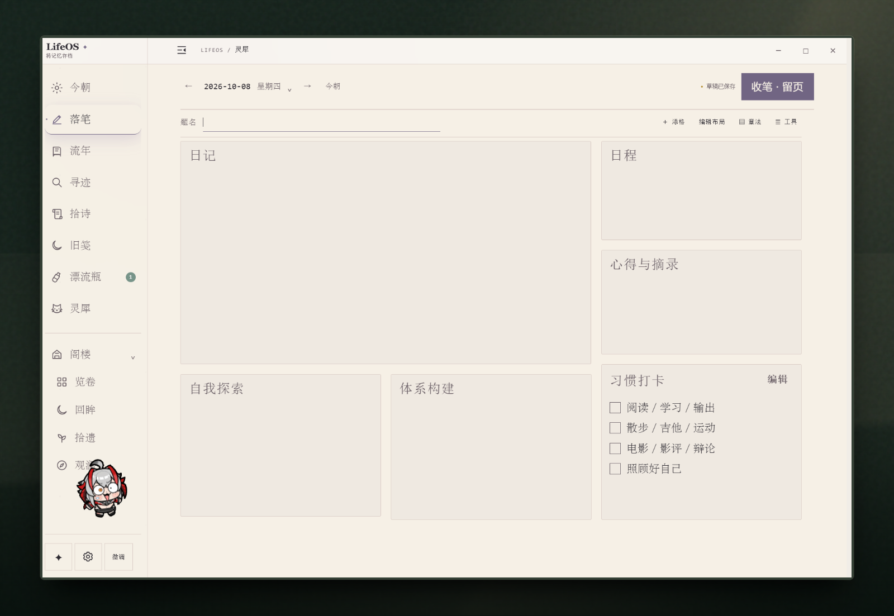
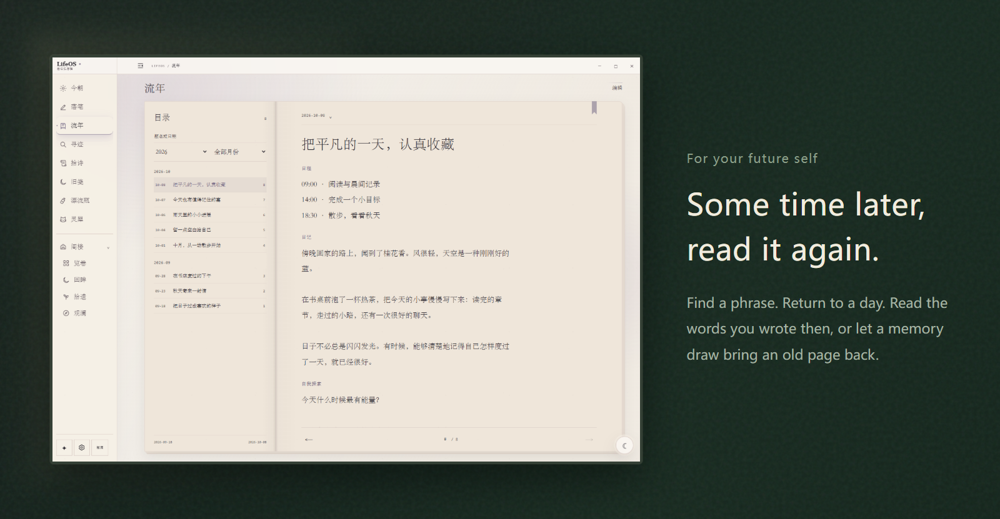
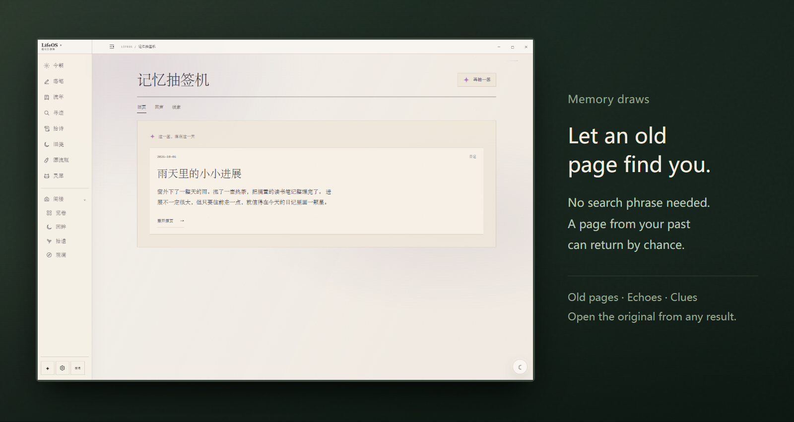
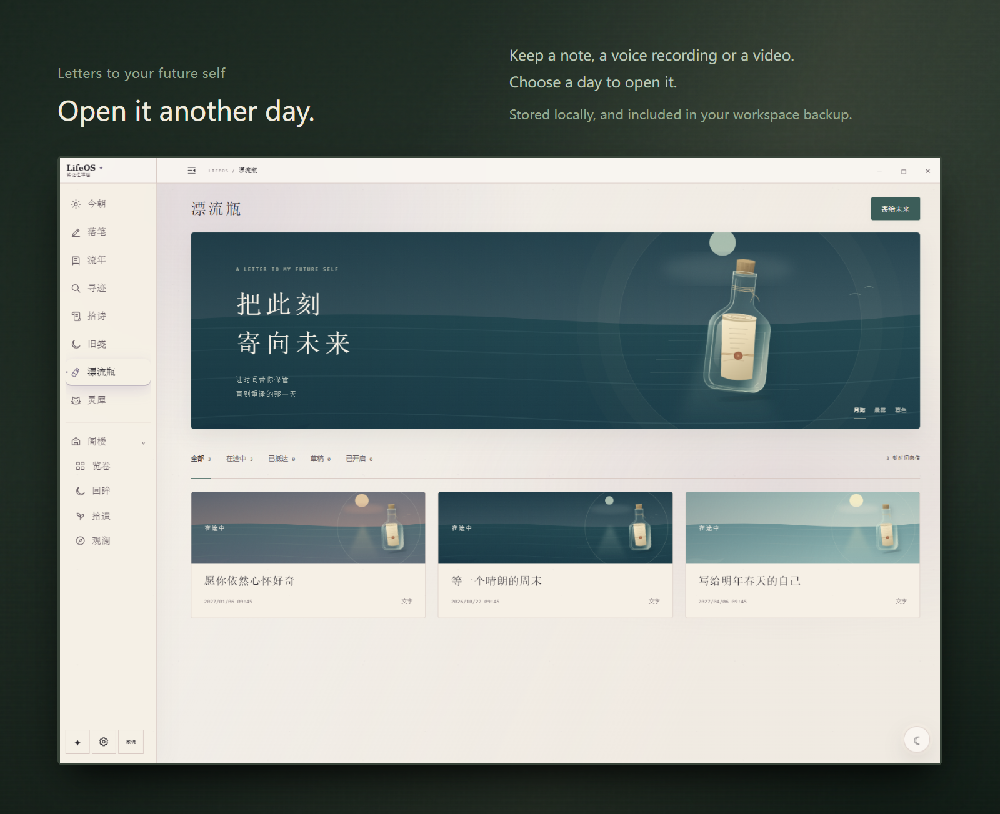
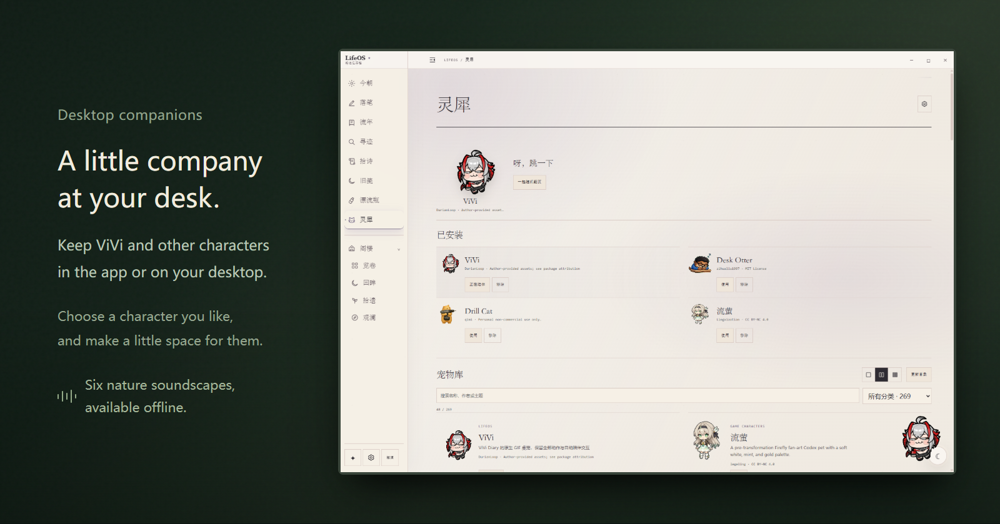

<a id="lifeos"></a>

<div align="center">

# LifeOS

### A local-first journal for personal memories and desktop companionship

**Write about today, revisit old entries, and leave a letter for your future self. Journals and revisions stay local; AI is optional.**

[](https://github.com/DurianLoop/LifeOS/releases/tag/v0.5.2)
[](#download)
[](#privacy)
[](LICENSE.md)

[中文](README.md) | English | [Changelog](https://github.com/DurianLoop/LifeOS/blob/v0.5.2/docs/RELEASE_v0.5.2.md)

Product website: [lifeos-diary.netlify.app](https://lifeos-diary.netlify.app/)

**[Website](https://lifeos-diary.netlify.app/) · [Download & installation](#download) · [Features](#features) · [Data & AI](#privacy) · [Run from source](#source)**

</div>

<br />

<a id="preview"></a>

<a href="docs/images/readme/workspace.png">
<picture>
  <source media="(max-width: 767px)" srcset="docs/images/readme/night/hero-en-mobile.png" />
  
</picture>
</a>

<br />

<a id="features"></a>

### Write a few lines

Keep journals, plans, and quotations on one desk, with paper panels you can move and resize. Drafts and revisions stay on your computer, and older journals can be imported. Put on the sound of rain and keep a companion nearby.

<br />

<a href="docs/images/readme/journal.png">
<picture>
  <source media="(max-width: 767px)" srcset="docs/images/readme/night/memory-en-mobile.png" />
  
</picture>
</a>

### Look back through the pages

Browse by date or find the original text with a keyword. Try a memory draw to revisit an entry you had not planned to look for. Leave a colorful bookmark where you want to return.

<br />

### Memory draws

<a href="docs/images/readme/memory.png">
<picture>
  <source media="(max-width: 767px)" srcset="docs/images/readme/night/draw-en-mobile.png" />
  
</picture>
</a>

Old pages, echoes, and clues all lead back to the original text. Newly saved entries are available immediately, and consecutive draws avoid recent results. Colorful bookmarks appear on both the page and in the contents.

<br />

### Open it later

Write a letter to your future self, add audio or video, and choose when to open it. Drift bottles stay on your computer and are included in workspace backups.

<a href="docs/images/readme/bottles.png">
<picture>
  <source media="(max-width: 767px)" srcset="docs/images/readme/night/letters-en-mobile.png" />
  
</picture>
</a>

<details>
<summary>About reminders</summary>

Drift bottles are local letters to your future self. Reminders require LifeOS to be running. If you fully quit the app, no reminder appears while it is closed; you can view bottles that are ready when you next open it.

</details>

### A little company

Six nature recordings play offline. ViVi and other pets can stay inside the app or on your desktop. Arrange the sidebar to suit your habits, and put less-used features in the Attic.

<a href="docs/images/readme/companion.png">
<picture>
  <source media="(max-width: 767px)" srcset="docs/images/readme/night/companion-en-mobile.png" />
  
</picture>
</a>

<p align="center"><picture><source media="(prefers-reduced-motion: reduce)" srcset="docs/images/readme/vivi-relax-still.png" /></picture><br /><sub>ViVi · A little company at your desk</sub></p>

<details>
<summary>Keep a companion on your desktop</summary>

In companion settings, choose the separate desktop mode and enable keeping the pet after the main window closes. Use the tray menu to reopen LifeOS or quit completely.

[ViVi attribution and license](docs/images/readme/VIVI-LICENSE.md)

</details>

<br />

---

<a id="download"></a>
<a id="quick-start"></a>

### Install and get started

**[Download for Windows](https://github.com/DurianLoop/LifeOS/releases/download/v0.5.2/LifeOS-Setup-0.5.2.exe)** &nbsp; · &nbsp; **[macOS&nbsp;Apple&nbsp;Silicon](https://github.com/DurianLoop/LifeOS/releases/download/v0.5.2/LifeOS-0.5.2-mac-arm64.dmg)** &nbsp; · &nbsp; **[macOS&nbsp;Intel](https://github.com/DurianLoop/LifeOS/releases/download/v0.5.2/LifeOS-0.5.2-mac-x64.dmg)**

The installers include the runtime. No separate Python or Node.js installation is needed. Start writing, or import existing journals in Markdown, TXT, HTML, JSON, CSV, or Day One JSON.

- **Windows x64:** run the `.exe` installer. The community build is not code-signed, so Windows may show a SmartScreen prompt.
- **macOS 11+:** choose the `.dmg` for your chip and drag LifeOS into Applications. This build uses ad-hoc signing and is not notarized by Apple. After verifying the source, you may need to allow it in **System Settings → Privacy & Security**.
- **Linux:** there is no prebuilt installer for v0.5.2. You can run from source.

[All installers and checksums](https://github.com/DurianLoop/LifeOS/releases/tag/v0.5.2) · [Issues and suggestions](https://github.com/DurianLoop/LifeOS/issues)

<a id="privacy"></a>

### Your words stay in your care

Journals, drafts, revisions, and attachments are stored locally by default. Everyday writing, reading, search, and nature sounds do not require a model. **When you use cloud AI, the relevant questions and text are sent to your configured service.**

<details>
<summary>AI, backups, and public sharing</summary>

**Connect AI when you want it.** Journal questions and Past Me send the current question and selected journal evidence. Classical-Chinese rewriting sends the text you submit. Personalized poetry may include that day's entry; automatic recommendations require a separate opt-in and may then send that day's entry automatically. Companion chat uses the current conversation and relevant public product guidance, without reading your journal text. [AI settings](https://github.com/DurianLoop/LifeOS/blob/v0.5.2/docs/AI设置与Codex接入.md)

**Local models.** The Ollama Demo requires you to install Ollama and download a model yourself. LifeOS installers do not include a large language model. [Ollama Demo](https://github.com/DurianLoop/LifeOS/blob/v0.5.2/docs/OLLAMA_DEMO.md)

**Keep a complete backup.** Workspace backups include journals, revisions, attachments, drafts, preferences, and drift-bottle media. Keep a copy on another drive. The installed Windows app stores its data in `%APPDATA%/LifeOS/workspace/`; on macOS, it is in `~/Library/Application Support/LifeOS/workspace/`. Source builds use the project directory by default.

**You choose what to publish.** Memorial pages require a separately configured hosting service. Select content, preview it, and explicitly publish. Only the selected snapshot goes online; later journal edits do not automatically update it. Published pages can be taken down. [Memorial pages and QR codes](https://github.com/DurianLoop/LifeOS/blob/v0.5.2/docs/纪念页与二维码.md)

</details>

<a id="source"></a>

<details>
<summary>Run from source</summary>

The README on main presents v0.5.2; the application source on main is still an earlier version. Explicitly check out the release tag. Requirements: Python 3.11+, Node.js 20+, and Git.

```bash
git clone --branch v0.5.2 --depth 1 https://github.com/DurianLoop/LifeOS.git
cd LifeOS
```

Windows:

```powershell
.\setup_desktop.bat
```

macOS / Linux:

```bash
bash setup_desktop.sh
```

The setup script creates an isolated `desktop/.venv` and checks Electron. After setup, use `start_desktop.bat` / `bash start_desktop.sh` to launch LifeOS. Add `--no-launch` to the setup command to install without launching.

For browser mode, first install `requirements.txt`, then run `start.bat` / `bash start.sh`.

</details>

<br />

<sub>LifeOS · [Personal, non-commercial license](LICENSE.md) · [Third-party companions](https://github.com/DurianLoop/LifeOS/tree/v0.5.2/app/assets/pets) · [Nature recording sources](https://github.com/DurianLoop/LifeOS/blob/v0.5.2/docs/WHITE_NOISE.md)</sub>

<sub>Demo journal entries and letters are fictional. [Image sources](docs/images/readme/CAPTURE.md) · [Back to top](#lifeos)</sub>
