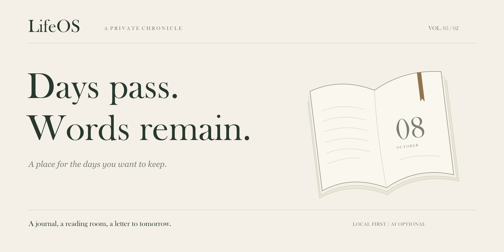
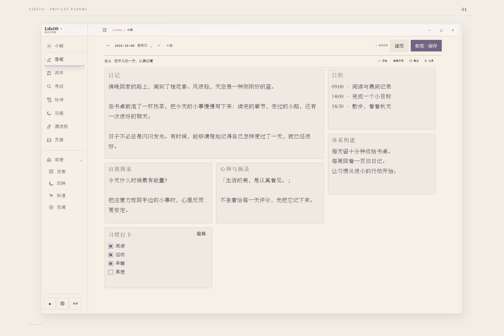
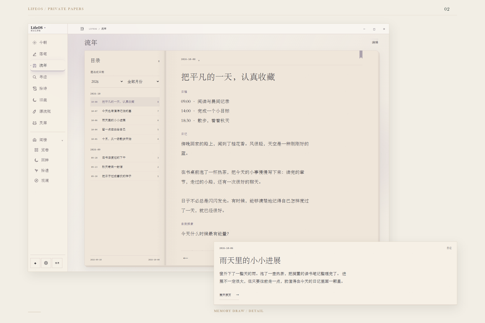
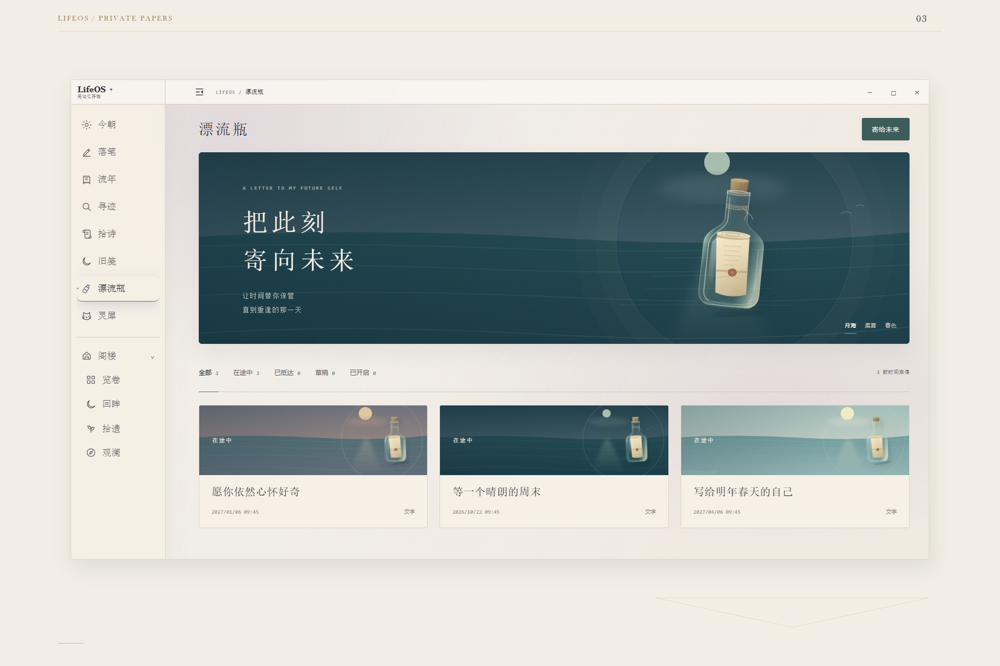

<a id="lifeos"></a>

<picture>
  <source media="(prefers-color-scheme: dark)" srcset="docs/images/readme/editorial/cover-en-dark.svg" />
  
</picture>

<p align="center"><strong>LifeOS</strong> · A local-first journal and a space for personal memories</p>
<p align="center"><sub><a href="https://github.com/DurianLoop/LifeOS/releases/tag/v0.5.2">v0.5.2</a> &nbsp; / &nbsp; Windows · macOS &nbsp; / &nbsp; AI optional</sub></p>
<p align="center"><a href="#download">Download</a> &nbsp; · &nbsp; <a href="#preview">Turn the pages</a> &nbsp; · &nbsp; <a href="#privacy">Privacy</a> &nbsp; · &nbsp; <a href="#source">Source</a> &nbsp; · &nbsp; <a href="README.md">中文</a></p>

<br />

<p align="center">A meal. A walk. A thought still taking shape.<br />Often, that is enough to write about.</p>
<p align="center">LifeOS makes room for a desk. Write about today, and leave a page for your future self.</p>

<br />

<a id="preview"></a>
<a id="features"></a>

<sub>01 &nbsp; / &nbsp; Write</sub>

## An ordinary day belongs on the page.

Take your time with today. Move and resize the paper panels, with a place for plans, quotations, and passing thoughts. Saved entries keep their revisions. When you want to read them again, the original page is there.

<a href="docs/images/readme/desk.png"></a>

<sub>A desk you can arrange · Drafts and revisions kept · Old journals welcome</sub>

<br />
<br />

<sub>02 &nbsp; / &nbsp; Return</sub>

## Days gone by are still yours to read.

Follow the dates back to an earlier you. Or let the memory draw choose: an old page, an echo, a clue that joins two moments. Open the original words and leave a colorful bookmark.

<a href="docs/images/readme/journal.png"></a>

<sub>v0.5.2 · Old pages / Echoes / Clues · Links to original entries · Bookmarks that stay after a restart</sub>

<details>
<summary>Open another page: the memory draw</summary>


Newly saved entries are available to draw immediately, and consecutive draws avoid recent results. Returning to the draw keeps your current page. Bookmarks can be removed at any time. [Release notes →](https://github.com/DurianLoop/LifeOS/blob/v0.5.2/docs/RELEASE_v0.5.2.md)

</details>

<br />
<br />

<sub>03 &nbsp; / &nbsp; Send</sub>

## Some words can wait.

Write a letter, record your voice, or save a moment on video. Choose a day to open it. When your future self returns, today's voice will still be there.

<a href="docs/images/readme/bottles.png"></a>

<sub>Text · Audio · Video · Scheduled opening · Reminders when the time comes</sub>

<br />
<br />

<sub>04 &nbsp; / &nbsp; Stay</sub>

## A little company. A little rain.


Choose a little companion to sit beside the page or in a corner of your desktop. Put on the sound of rain. Tuck the features you do not need into the Attic. Let the desk settle into your habits.

Six nature recordings come with the app and play offline. ViVi and other characters can stay inside LifeOS or become separate desktop pets. You can let them stay when the main window closes, too.

<details>
<summary>Visit the companions' little corner</summary>


Character artwork retains its creators' attribution and licenses. [ViVi attribution and license](docs/images/readme/editorial/VIVI-LICENSE.md).

</details>

<br clear="all" />
<br />

<a id="privacy"></a>

## Your words, close to home.

Journals, attachments, revisions, and settings are stored on your computer. Writing, reading, search, and nature sounds need no model connection. When you want help reflecting, you can choose AI journal questions, Past Me, classical-Chinese rewriting, or poetry recommendations.

**When you use cloud AI, the relevant questions and text are sent to your configured service.** The Ollama Demo can connect to a local model; install Ollama and download a model yourself. Public memorial pages require you to select content, preview it, and explicitly publish it.

<details>
<summary>What is sent to AI?</summary>

- Journal questions and Past Me: the current question and selected journal evidence.
- Classical-Chinese rewriting: the text you submit for that action.
- Personalized poetry: relevant input, including that day's journal entry. Automatic recommendations require a separate opt-in and may then send that day's text automatically.
- Companion chat: the current conversation and relevant public product guidance. It does not read your journal text.

Connect a model API, a supported local CC Switch / Codex configuration, or the Ollama Demo. The installers do not include a large language model. [AI settings](https://github.com/DurianLoop/LifeOS/blob/v0.5.2/docs/AI设置与Codex接入.md) · [Ollama Demo](https://github.com/DurianLoop/LifeOS/blob/v0.5.2/docs/OLLAMA_DEMO.md)

</details>

<details>
<summary>Where are my journals? How do backup and sharing work?</summary>

The installed Windows app stores its workspace in `%APPDATA%/LifeOS/workspace/`; on macOS, it is in `~/Library/Application Support/LifeOS/workspace/`. Source builds use the project directory by default.

Workspace backups include journals, revisions, attachments, drafts, preferences, and drift-bottle media. Keep a copy on another drive. Backups are validated before restoration, and restoring requires a restart. Windows desktop updates save drafts and create a safety backup first. For macOS upgrades, download the installer again.

Public memorial pages require a separately configured hosting service. Only explicitly selected and published snapshots go online. Later edits to your journal do not automatically update the public page, and published pages can be taken down. [Memorial pages and QR codes →](https://github.com/DurianLoop/LifeOS/blob/v0.5.2/docs/纪念页与二维码.md)

</details>

<br />

<a id="download"></a>
<a id="quick-start"></a>

## Begin with today.

**[Windows x64 ↗](https://github.com/DurianLoop/LifeOS/releases/download/v0.5.2/LifeOS-Setup-0.5.2.exe)** &nbsp; / &nbsp; **[macOS · Apple Silicon ↗](https://github.com/DurianLoop/LifeOS/releases/download/v0.5.2/LifeOS-0.5.2-mac-arm64.dmg)** &nbsp; / &nbsp; **[macOS · Intel ↗](https://github.com/DurianLoop/LifeOS/releases/download/v0.5.2/LifeOS-0.5.2-mac-x64.dmg)**

v0.5.2 · The installers include the runtime. No separate Python or Node.js installation is needed.

Write your first entry, or bring in the journals you already keep. AI can wait. Start by giving today a page.

[All release files and checksums](https://github.com/DurianLoop/LifeOS/releases/tag/v0.5.2) &nbsp; · &nbsp; [User guide](https://github.com/DurianLoop/LifeOS/blob/v0.5.2/docs/PRODUCT_HELP.md) &nbsp; · &nbsp; [Issues and suggestions](https://github.com/DurianLoop/LifeOS/issues)

<details>
<summary>Installation notes</summary>

- **Windows x64:** run the `.exe` installer, then open LifeOS from the Start menu. The community build is not code-signed, so Windows may show a SmartScreen prompt.
- **macOS 11+:** choose the `.dmg` for your chip and drag LifeOS into Applications. This build uses ad-hoc signing and is not notarized by Apple. After verifying the download source, you may need to allow it in **System Settings → Privacy & Security**.
- **Linux:** there is no prebuilt installer for this release. You can run from source.
- **Checksums:** the release includes `SHA256SUMS.txt` for Windows and `SHA256SUMS-macos-v0.5.2.txt` for macOS.

</details>

<a id="faq"></a>

<details>
<summary>A few questions about importing, exporting, and everyday use</summary>

**Can I bring in journals I already have?**

Markdown, TXT, HTML, generic JSON, CSV, and Day One JSON are supported. After importing, check the dates and original text in the journal view.

**How is an export different from a backup?**

Exports contain the current journal entries in Markdown, JSON, or CSV. To keep revisions, attachments, drafts, preferences, and drift-bottle media together, use a full workspace backup.

**Are drift bottles sent to other people?**

They are local letters to your future self, not a message exchange with strangers. Reminders require LifeOS to be running. If you fully quit the app, no reminder appears while it is closed; bottles that are ready will be there when you next open it.

**How can a pet stay after I close the window?**

In companion settings, choose the separate desktop mode and enable keeping the pet after the main window closes. Use the tray menu to reopen LifeOS or quit completely.

</details>

<a id="source"></a>

<details>
<summary>Run and build from source</summary>

**The README on main presents v0.5.2; the application source on main is still an earlier version.** To use the features shown here, download a release installer or explicitly check out v0.5.2. Requirements: Python 3.11+, Node.js 20+, and Git.

```bash
git clone --branch v0.5.2 --depth 1 https://github.com/DurianLoop/LifeOS.git
cd LifeOS
```

Windows:

```powershell
.\setup_desktop.bat
```

macOS / Linux:

```bash
bash setup_desktop.sh
```

The setup script creates an isolated `desktop/.venv` environment and checks Electron. After setup, use `start_desktop.bat` / `bash start_desktop.sh` to launch LifeOS. Add `--no-launch` to the setup command to install without launching.

For browser mode, first install `requirements.txt`, then run `start.bat` / `bash start.sh`.

To build a Windows installer, place an x64 CPython runtime in `desktop/python-runtime/` and install `requirements.txt` and Pillow into that runtime. For embeddable Python, enable `import site` and `Lib/site-packages` in `._pth`, then run:

```powershell
cd desktop
npm ci
npm run dist:win -- --publish=never
```

Build output is written to `desktop/dist/`. Keep local workspaces, credentials, runtimes, and build output out of Git.

</details>

<br />

---

<sub>The application code is available under a [personal, non-commercial license](LICENSE.md). [Companion artwork](https://github.com/DurianLoop/LifeOS/tree/v0.5.2/app/assets/pets) and [nature recordings](https://github.com/DurianLoop/LifeOS/blob/v0.5.2/docs/WHITE_NOISE.md) retain their original attribution and licenses. Thank you to their creators, and to everyone who has made LifeOS part of an ordinary day.</sub>

<sub>Shown here: the actual v0.5.2 interface with fictional demo text. Presentation panels use crops and layout; click through to the original screenshots. [Screenshot and design sources](docs/images/readme/CAPTURE.md).</sub>

<br />

<p align="center">A few words, and today takes shape.</p>
<p align="center"><sub>LifeOS &nbsp; / &nbsp; A private chronicle.</sub></p>
<p align="center"><sub><a href="#lifeos">Back to the opening page ↑</a></sub></p>
