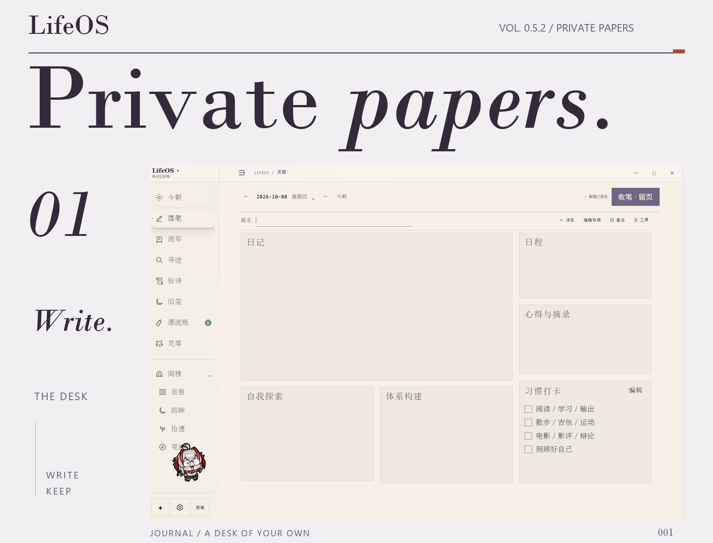
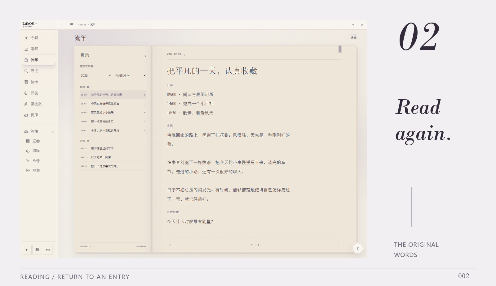

<a id="lifeos"></a>
<a id="preview"></a>
<a id="features"></a>

<a href="docs/images/readme/workspace.png">
<picture>
  <source media="(max-width: 767px) and (prefers-color-scheme: dark)" srcset="docs/images/readme/editorial/opening-en-dark-mobile.png" />
  <source media="(max-width: 767px)" srcset="docs/images/readme/editorial/opening-en-light-mobile.png" />
  <source media="(prefers-color-scheme: dark)" srcset="docs/images/readme/editorial/opening-en-dark.png" />
  
</picture>
</a>

<br />

LifeOS is a local-first journal for writing, reading, and revisiting personal records. Entries and revisions stay on your computer. AI is optional.

[Download v0.5.2](#download) &nbsp; · &nbsp; [中文](README.md) &nbsp; · &nbsp; [User guide](https://github.com/DurianLoop/LifeOS/blob/v0.5.2/docs/PRODUCT_HELP.md) &nbsp; · &nbsp; [Release notes](https://github.com/DurianLoop/LifeOS/blob/v0.5.2/docs/RELEASE_v0.5.2.md)

<sub>[View original workspace](docs/images/readme/workspace.png)</sub>

<br />

### 01 / Writing

Write journals, plans, and quotations on movable, resizable paper panels. Drafts and revisions stay local, and existing journals can be imported.

<br />

<a href="docs/images/readme/journal.png">
<picture>
  <source media="(max-width: 767px) and (prefers-color-scheme: dark)" srcset="docs/images/readme/editorial/reading-en-dark-mobile.png" />
  <source media="(max-width: 767px)" srcset="docs/images/readme/editorial/reading-en-light-mobile.png" />
  <source media="(prefers-color-scheme: dark)" srcset="docs/images/readme/editorial/reading-en-dark.png" />
  
</picture>
</a>

<br />

### 02 / Reading

Browse by date, search for a phrase, or let the memory draw choose an old page, an echo, or a clue. Open the source entry and leave a colorful bookmark where you want to return.

<details>
<summary>Memory draws</summary>


Newly saved entries are available immediately. Consecutive draws avoid recent results, and returning keeps the current page. Bookmarks appear on the page and in the contents, survive restarts, and can be removed at any time.

</details>

<br />

### 03 / Unopened

Write a letter, then give it an opening date. Drift bottles can hold text, audio, or video until the time you choose. Their contents stay on your computer and are included in workspace backups.

<details>
<summary>View drift bottles</summary>


Drift bottles are local letters to your future self, not a message exchange with strangers. Reminders require LifeOS to be running. If you fully quit the app, no reminder appears while it is closed; you can view bottles that are ready when you next open it.

</details>

### 04 / In the margins

Six nature recordings play offline. ViVi and other pets can stay inside the app or on your desktop. Choose the order and visibility of sidebar features, and put less-used tools in the Attic.

<details>
<summary>View pets and companion settings</summary>


In companion settings, choose the separate desktop mode and enable keeping the pet after the main window closes. Use the tray menu to reopen LifeOS or quit completely.

Artwork retains its creators' attribution and licenses. [ViVi attribution and license](docs/images/readme/editorial/VIVI-LICENSE.md).

</details>

<br />

---

<a id="privacy"></a>

### Your words are stored locally by default

Everyday writing, reading, search, and nature sounds do not require a model. AI is optional for journal questions, Past Me, classical-Chinese rewriting, poetry recommendations, and companion chat.

**When you use cloud AI, the relevant questions and text are sent to your configured service.** The Ollama Demo can connect to a local model; install Ollama and download a model yourself. Public memorial pages require you to select content, preview it, and explicitly publish it.

<details>
<summary>What does AI receive?</summary>

- Journal questions and Past Me: the current question and selected journal evidence.
- Classical-Chinese rewriting: the text you submit for that action.
- Personalized poetry: relevant input, including that day's journal entry. Automatic recommendations require a separate opt-in and may then send that day's text automatically.
- Companion chat: the current conversation and relevant public product guidance. It does not read your journal text.

Connect a model API, a supported local CC Switch / Codex configuration, or the Ollama Demo. The installers do not include a large language model.

[AI settings](https://github.com/DurianLoop/LifeOS/blob/v0.5.2/docs/AI设置与Codex接入.md) · [Ollama Demo](https://github.com/DurianLoop/LifeOS/blob/v0.5.2/docs/OLLAMA_DEMO.md)

</details>

<details>
<summary>Data locations, backups, and public sharing</summary>

Installed Windows app: `%APPDATA%/LifeOS/workspace/`. macOS: `~/Library/Application Support/LifeOS/workspace/`. Source builds use the project directory by default.

Workspace backups include journals, revisions, attachments, drafts, preferences, and drift-bottle media. Keep a copy on another drive. Backups are validated before restoration, and restoring requires a restart. Windows desktop updates save drafts and create a safety backup first. For macOS upgrades, download the installer again.

Public memorial pages require a separately configured hosting service. Only selected and published snapshots go online. Later edits to your journal do not automatically update the public page, and published pages can be taken down. [Memorial pages and QR codes →](https://github.com/DurianLoop/LifeOS/blob/v0.5.2/docs/纪念页与二维码.md)

</details>

<a id="faq"></a>

<details>
<summary>Import and export</summary>

The built-in importers support Markdown, TXT, HTML, generic JSON, CSV, and Day One JSON. After importing, check the dates and original text in the journal view.

Exports contain the current journal entries in Markdown, JSON, or CSV. To preserve revisions, attachments, drafts, preferences, and drift-bottle media together, use a workspace backup.

</details>

<a id="download"></a>
<a id="quick-start"></a>

### Download and get started

**[Windows&nbsp;x64](https://github.com/DurianLoop/LifeOS/releases/download/v0.5.2/LifeOS-Setup-0.5.2.exe)** &nbsp; / &nbsp; **[macOS&nbsp;·&nbsp;Apple&nbsp;Silicon](https://github.com/DurianLoop/LifeOS/releases/download/v0.5.2/LifeOS-0.5.2-mac-arm64.dmg)** &nbsp; / &nbsp; **[macOS&nbsp;·&nbsp;Intel](https://github.com/DurianLoop/LifeOS/releases/download/v0.5.2/LifeOS-0.5.2-mac-x64.dmg)**

The installers include the runtime. No separate Python or Node.js installation is needed. On first launch, write an entry or import your old journals. You do not need to configure AI to begin.

[Release files and checksums](https://github.com/DurianLoop/LifeOS/releases/tag/v0.5.2) · [User guide](https://github.com/DurianLoop/LifeOS/blob/v0.5.2/docs/PRODUCT_HELP.md) · [Issues and suggestions](https://github.com/DurianLoop/LifeOS/issues)

<details>
<summary>Platforms and installation</summary>

- **Windows x64:** run the `.exe` installer, then open LifeOS from the Start menu. The community build is not code-signed, so Windows may show a SmartScreen prompt.
- **macOS 11+:** choose the `.dmg` for your chip and drag LifeOS into Applications. This build uses ad-hoc signing and is not notarized by Apple. After verifying the download source, you may need to allow it in **System Settings → Privacy & Security**.
- **Linux:** there is no prebuilt installer for this release. You can run from source.
- **Checksums:** the release includes `SHA256SUMS.txt` for Windows and `SHA256SUMS-macos-v0.5.2.txt` for macOS.

</details>

<a id="source"></a>

<details>
<summary>Run and build from source</summary>

**The README on main presents v0.5.2; the application source on main is still an earlier version.** Use a release installer or explicitly check out v0.5.2. Requirements: Python 3.11+, Node.js 20+, and Git.

```bash
git clone --branch v0.5.2 --depth 1 https://github.com/DurianLoop/LifeOS.git
cd LifeOS
```

Windows:

```powershell
.\setup_desktop.bat
```

macOS / Linux:

```bash
bash setup_desktop.sh
```

The setup script creates an isolated `desktop/.venv` environment and checks Electron. After setup, use `start_desktop.bat` / `bash start_desktop.sh` to launch LifeOS. Add `--no-launch` to the setup command to install without launching.

For browser mode, first install `requirements.txt`, then run `start.bat` / `bash start.sh`.

To build a Windows installer, place an x64 CPython runtime in `desktop/python-runtime/` and install `requirements.txt` and Pillow into that runtime. For embeddable Python, enable `import site` and `Lib/site-packages` in `._pth`, then run:

```powershell
cd desktop
npm ci
npm run dist:win -- --publish=never
```

Build output is written to `desktop/dist/`. Keep local workspaces, credentials, runtimes, and build output out of Git.

</details>

<br />

---

<sub>LifeOS · [Personal, non-commercial license](LICENSE.md) · [Third-party companions](https://github.com/DurianLoop/LifeOS/tree/v0.5.2/app/assets/pets) · [Nature recording sources](https://github.com/DurianLoop/LifeOS/blob/v0.5.2/docs/WHITE_NOISE.md)</sub>

<sub>Journal entries and letters in the feature previews are fictional. [Image sources](docs/images/readme/CAPTURE.md) · [Back to top](#lifeos)</sub>
