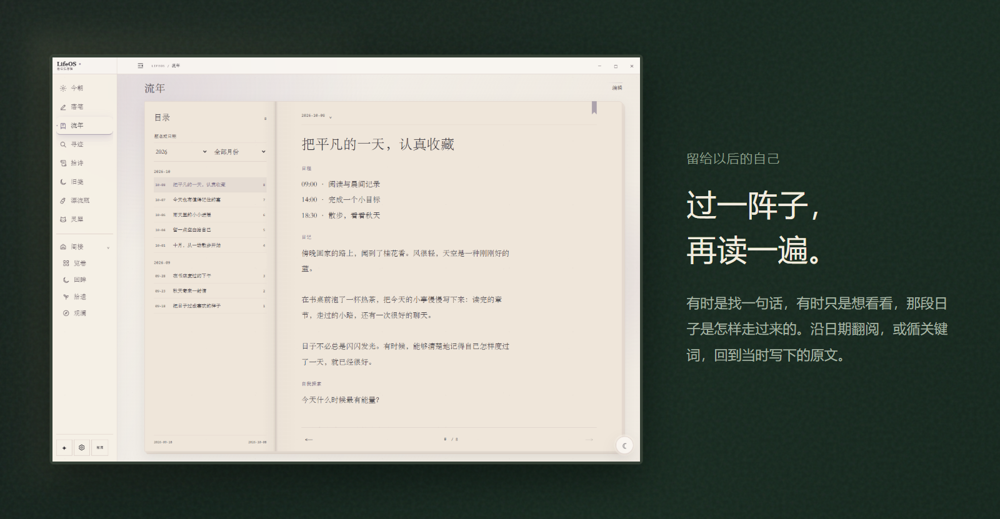
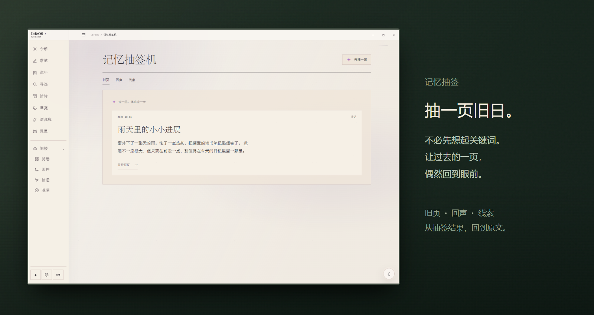
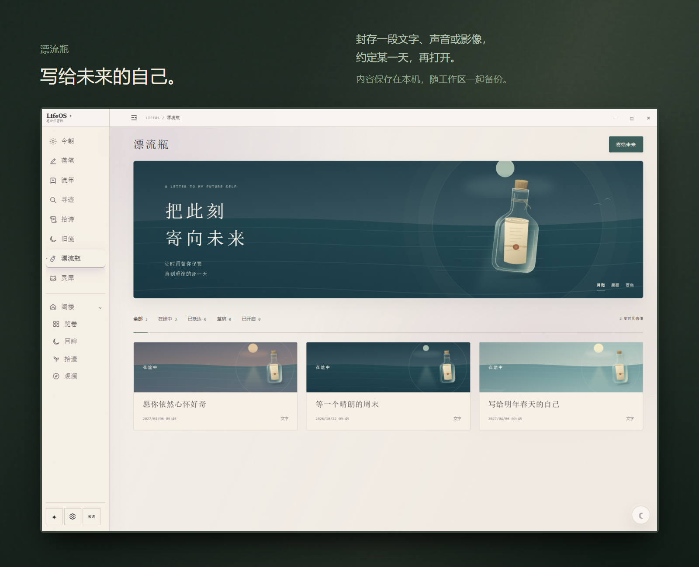
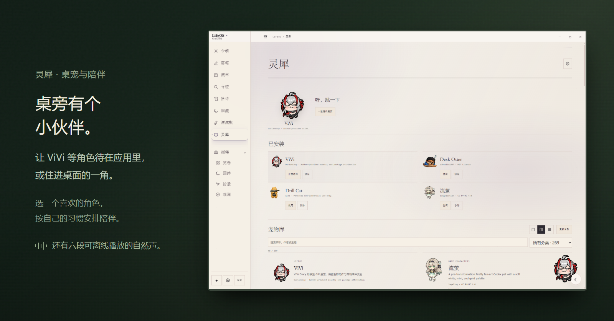

<a id="lifeos"></a>

<div align="center">

# LifeOS

### 本地优先的日记、个人记忆与桌面陪伴

**记录今天，翻阅往事，给未来的自己留一封信。日记与修订保存在本机，AI 按需接入。**

[](https://github.com/DurianLoop/LifeOS/releases/tag/v0.5.2)
[](#download)
[](#privacy)
[](LICENSE.md)

中文 | [English](README.en.md) | [更新日志](https://github.com/DurianLoop/LifeOS/blob/v0.5.2/docs/RELEASE_v0.5.2.md)

**[下载与安装](#download) · [功能预览](#features) · [数据与 AI](#privacy) · [源码运行](#source)**

</div>

<br />

<a id="preview"></a>

<a href="docs/images/readme/workspace.png">
<picture>
  <source media="(max-width: 767px)" srcset="docs/images/readme/night/hero-zh-mobile.png" />
  
</picture>
</a>

<br />

<a id="features"></a>

### 先写几行

日记、日程和摘录放在同一张书桌上，纸页可以自由挪动、缩放。草稿与修订保存在本机，从前的日记也可以导入。打开一段雨声，喜欢的桌宠就在旁边。

<br />

<a href="docs/images/readme/journal.png">
<picture>
  <source media="(max-width: 767px)" srcset="docs/images/readme/night/memory-zh-mobile.png" />
  
</picture>
</a>

### 回头翻翻

按日期翻页，用关键词找到原文。也可以抽一张记忆签，重读一篇没打算找的日记。想再读的地方，留下一枚彩笺。

<br />

### 记忆抽签

<a href="docs/images/readme/memory.png">
<picture>
  <source media="(max-width: 767px)" srcset="docs/images/readme/night/draw-zh-mobile.png" />
  
</picture>
</a>

「旧页」「回声」「线索」三种抽法都能返回原文。新保存的日记可立即抽取，连续抽取避开近期结果；彩色书签在书页和目录中同步保留。

<br />

### 晚一点，再打开

给未来的自己写一封信，放进录音或视频，定好拆开的日期。漂流瓶保存在本机，随工作区一起备份。

<a href="docs/images/readme/bottles.png">
<picture>
  <source media="(max-width: 767px)" srcset="docs/images/readme/night/letters-zh-mobile.png" />
  
</picture>
</a>

<details>
<summary>到期提醒说明</summary>

漂流瓶是本地写给未来的内容。到期提醒需要 LifeOS 正在运行；完全退出期间不会弹出提醒，下次打开后可以查看已到期的瓶子。

</details>

### 还有一点陪伴

六段自然声可以离线播放。ViVi 等桌宠可以留在应用里，也可以走到桌面上。侧栏按自己的习惯排列，不常用的功能收进阁楼。

<a href="docs/images/readme/companion.png">
<picture>
  <source media="(max-width: 767px)" srcset="docs/images/readme/night/companion-zh-mobile.png" />
  
</picture>
</a>

<p align="center"><picture><source media="(prefers-reduced-motion: reduce)" srcset="docs/images/readme/vivi-relax-still.png" /></picture><br /><sub>ViVi · 一点桌边的陪伴</sub></p>

<details>
<summary>让桌宠留在桌面</summary>

在灵犀设置中选择独立桌面模式，并开启关闭主窗口后保留桌宠。通过托盘可以重新打开 LifeOS，或完全退出。

[ViVi 来源与许可](docs/images/readme/VIVI-LICENSE.md)

</details>

<br />

---

<a id="download"></a>
<a id="quick-start"></a>

### 安装与开始

**[下载 Windows](https://github.com/DurianLoop/LifeOS/releases/download/v0.5.2/LifeOS-Setup-0.5.2.exe)** &nbsp; · &nbsp; **[macOS&nbsp;Apple&nbsp;Silicon](https://github.com/DurianLoop/LifeOS/releases/download/v0.5.2/LifeOS-0.5.2-mac-arm64.dmg)** &nbsp; · &nbsp; **[macOS&nbsp;Intel](https://github.com/DurianLoop/LifeOS/releases/download/v0.5.2/LifeOS-0.5.2-mac-x64.dmg)**

安装包已包含运行环境，无需另装 Python 或 Node.js。打开后即可写作，或导入已有的 Markdown、TXT、HTML、JSON、CSV 与 Day One JSON 日记。

- **Windows x64**：运行 `.exe` 安装程序。社区构建未进行代码签名，可能出现 SmartScreen 提示。
- **macOS 11+**：选择对应芯片的 `.dmg`，将 LifeOS 拖入 Applications。当前为 ad-hoc 签名，未经 Apple 公证；核实来源后，可在「系统设置 → 隐私与安全性」中允许打开。
- **Linux**：v0.5.2 暂无预构建安装包，可从源码运行。

[全部安装包与校验值](https://github.com/DurianLoop/LifeOS/releases/tag/v0.5.2) · [问题与建议](https://github.com/DurianLoop/LifeOS/issues)

<a id="privacy"></a>

### 文字由你保管

日记、草稿、修订与附件默认保存在本机。基础写作、阅读、搜索和自然声不依赖模型；**使用云端 AI 时，相应的提问与文字会发送给你配置的服务。**

<details>
<summary>AI、备份与公开分享</summary>

**按需接入 AI。** 日记问答与「以前的我」会发送本次问题及所选日记证据；文言化会发送提交的文字；个性化荐诗可能包含当天日记；自动荐诗需单独开启，开启后可自动发送当日正文。桌宠聊天使用当前对话与按需匹配的公开产品指南，不读取日记正文。[AI 设置](https://github.com/DurianLoop/LifeOS/blob/v0.5.2/docs/AI设置与Codex接入.md)

**本地模型。** Ollama Demo 需要自行安装 Ollama 并下载模型，安装包不含大模型。[Ollama Demo](https://github.com/DurianLoop/LifeOS/blob/v0.5.2/docs/OLLAMA_DEMO.md)

**保留完整备份。** 工作区备份包含日记、修订、附件、草稿、偏好和漂流瓶媒体，建议另存一份到其他磁盘。Windows 安装版数据位于 `%APPDATA%/LifeOS/workspace/`，macOS 位于 `~/Library/Application Support/LifeOS/workspace/`。源码运行默认使用项目目录。

**公开分享由你发起。** 纪念页需要另行配置托管服务，选定内容、预览并主动发布。只公开选定的快照，之后修改日记不会自动同步；已发布内容可以撤回。[纪念页与二维码](https://github.com/DurianLoop/LifeOS/blob/v0.5.2/docs/纪念页与二维码.md)

</details>

<a id="source"></a>

<details>
<summary>从源码运行</summary>

main 首页介绍 v0.5.2，main 的应用源码仍是较早版本。请显式检出发行标签。环境要求：Python 3.11+、Node.js 20+、Git。

```bash
git clone --branch v0.5.2 --depth 1 https://github.com/DurianLoop/LifeOS.git
cd LifeOS
```

Windows：

```powershell
.\setup_desktop.bat
```

macOS / Linux：

```bash
bash setup_desktop.sh
```

安装脚本创建独立的 `desktop/.venv` 并检查 Electron。后续使用 `start_desktop.bat` / `bash start_desktop.sh` 启动；向 setup 脚本追加 `--no-launch` 可只安装不启动。

浏览器模式先安装 `requirements.txt`，再运行 `start.bat` / `bash start.sh`。

</details>

<br />

<sub>LifeOS · [个人、非商业用途许可](LICENSE.md) · [第三方桌宠](https://github.com/DurianLoop/LifeOS/tree/v0.5.2/app/assets/pets) · [自然声来源](https://github.com/DurianLoop/LifeOS/blob/v0.5.2/docs/WHITE_NOISE.md)</sub>

<sub>演示日记与来信均为虚构内容。[图像来源](docs/images/readme/CAPTURE.md) · [回到顶部](#lifeos)</sub>
