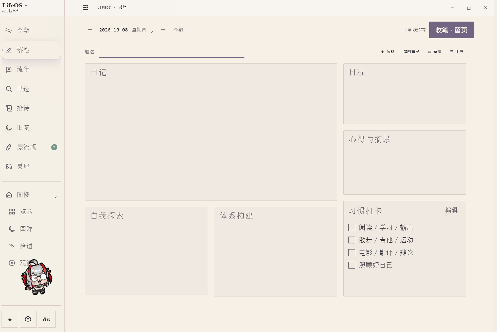
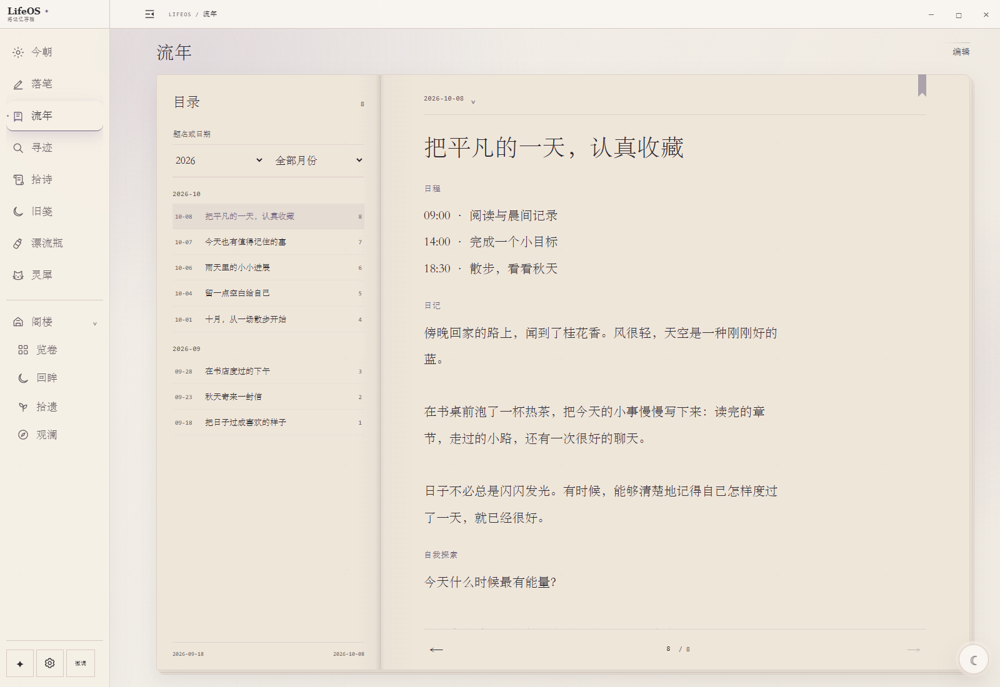
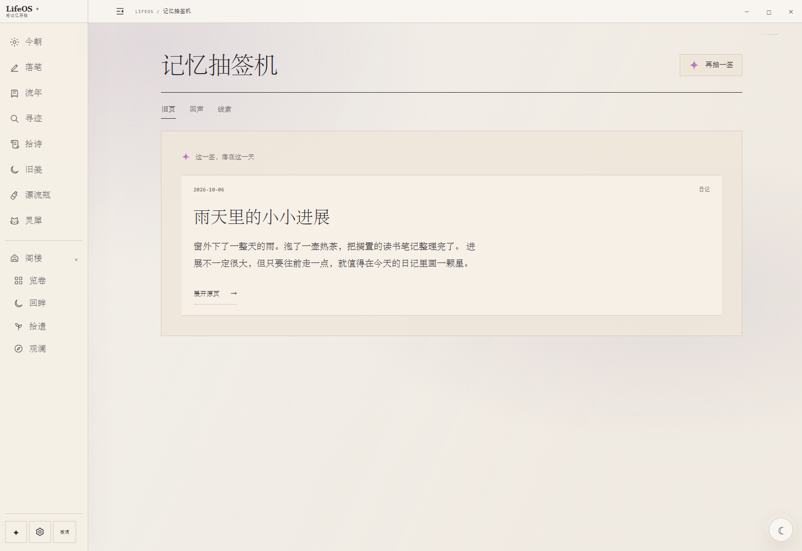
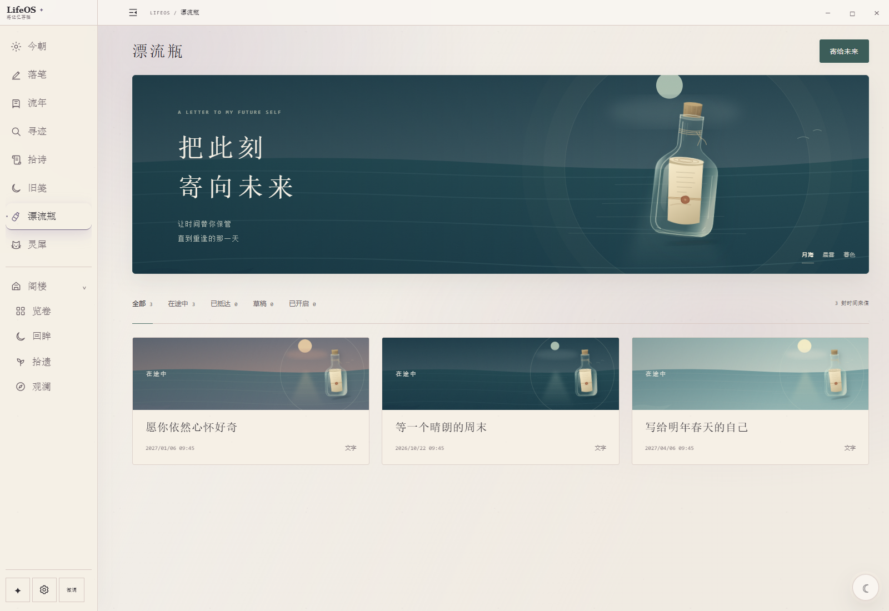
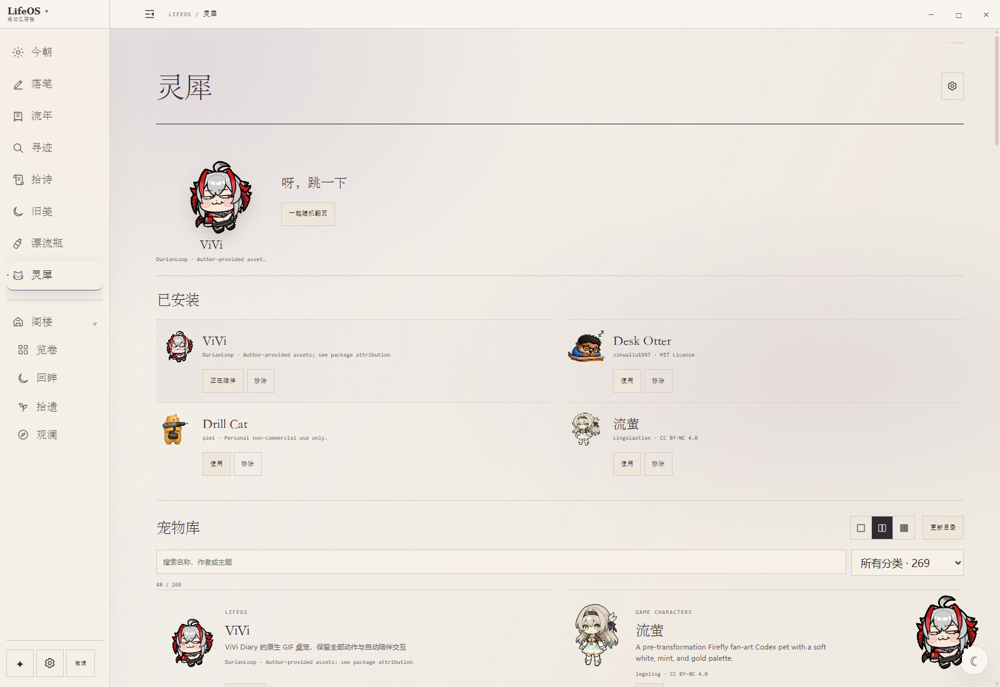

<a id="lifeos"></a>

<picture>
  <source media="(prefers-color-scheme: dark)" srcset="docs/images/readme/editorial/masthead-dark.svg" />
  
</picture>

### 当时如此。

记忆会改口，日记保留原句。LifeOS 是本地优先的日记与个人记忆空间：记录当天的事，保存当时的说法；日后翻阅、检索，也偶尔读到计划之外的一页。

**[Windows](https://github.com/DurianLoop/LifeOS/releases/download/v0.5.2/LifeOS-Setup-0.5.2.exe)** &nbsp; / &nbsp; **[macOS&nbsp;·&nbsp;Apple&nbsp;Silicon](https://github.com/DurianLoop/LifeOS/releases/download/v0.5.2/LifeOS-0.5.2-mac-arm64.dmg)** &nbsp; / &nbsp; **[macOS&nbsp;·&nbsp;Intel](https://github.com/DurianLoop/LifeOS/releases/download/v0.5.2/LifeOS-0.5.2-mac-x64.dmg)**

<sub>[v0.5.2](https://github.com/DurianLoop/LifeOS/releases/tag/v0.5.2) · 运行环境已包含 · AI 可选 &nbsp; / &nbsp; [English](README.en.md) · [安装说明](#download) · [源码](#source)</sub>

<br />

<a id="preview"></a>
<a id="features"></a>

<p align="right"><a href="docs/images/readme/workspace.png"></a></p>
<p align="right"><sub>01 &nbsp; 落笔 / 书桌可以按自己的习惯重新布置。</sub></p>

### 原稿

一件事还没有结论，也可以先记下来。日记、日程和摘录放在同一张书桌上；纸页可以移动、缩放，草稿与修订保存在本机。从前的日记，也可以一起带进来。

<br />

### 重读

沿日期翻阅，循关键词回到原文。记忆抽签提供另一种读法：抽取「旧页」「回声」或「线索」，再从结果打开原页。想再读的地方，可以留下一枚彩笺。

<p><a href="docs/images/readme/journal.png"></a></p>

<sub>02 &nbsp; 流年 / 每一次回看，都从原文开始。</sub>

<details>
<summary>记忆抽签与 v0.5.2 更新</summary>



新保存的日记可立即抽取，连续抽取避开近期结果；返回时保留当前一页。打开原页后，书页与目录会留下彩色书签，重启后保留，也可随时取消。

本版还优化了「拾诗」「旧笺」命名、白噪音细滑条和灵犀布局。[完整更新说明 →](https://github.com/DurianLoop/LifeOS/blob/v0.5.2/docs/RELEASE_v0.5.2.md)

</details>

<br />

### 收件人：自己

写完一封信，再注明拆信日期。漂流瓶可以封存文字、录音或视频，等约定的时间再打开。内容保存在本机，随工作区一起备份。

<details>
<summary>查看漂流瓶</summary>



漂流瓶是本地写给未来的内容，不是陌生人交换消息的服务。到期提醒需要 LifeOS 正在运行；完全退出期间不会弹出提醒，下次打开后可查看已到期的瓶子。

</details>

### 书桌之外

六段自然声可以离线播放。ViVi 等桌宠可以待在应用里，也可以留在桌面；侧栏的功能顺序和显示方式由你安排。不常用的工具，收进阁楼即可。

<details>
<summary>查看桌宠与陪伴设置</summary>



在灵犀设置中选择独立桌面模式，并开启关闭主窗口后保留桌宠，即可在关闭主窗口后继续显示。通过托盘可重新打开 LifeOS，或完全退出。

素材保留各自作者的署名与许可。[ViVi 来源说明](docs/images/readme/editorial/VIVI-LICENSE.md)。

</details>

<br />

---

<a id="privacy"></a>

### 文字默认保存在本机

基础写作、阅读、搜索和自然声不依赖模型。AI 用于日记问答、「以前的我」、文言化、诗句推荐或桌宠聊天，可以按需接入。

**使用云端 AI 时，相应的提问与文字会发送给你配置的服务。** Ollama Demo 可连接本机模型，需要自行安装 Ollama 并下载模型。公开纪念页需要选定内容、预览并主动发布。

<details>
<summary>AI 会接收哪些内容？</summary>

- 日记问答与「以前的我」：本次问题及所选日记证据。
- 文言化：本次提交的文字。
- 个性化荐诗：当天日记等相关输入；自动荐诗需单独开启，开启后可自动发送当日正文。
- 桌宠聊天：当前聊天与按需匹配的公开产品指南，不读取日记正文。

支持模型 API、符合条件时的 CC Switch / Codex 配置，以及 Ollama Demo。安装包不含大模型。

[AI 设置](https://github.com/DurianLoop/LifeOS/blob/v0.5.2/docs/AI设置与Codex接入.md) · [Ollama Demo](https://github.com/DurianLoop/LifeOS/blob/v0.5.2/docs/OLLAMA_DEMO.md)

</details>

<details>
<summary>数据位置、备份与公开分享</summary>

Windows 安装版：`%APPDATA%/LifeOS/workspace/`；macOS：`~/Library/Application Support/LifeOS/workspace/`。源码运行默认使用项目目录。

工作区备份包含日记、修订、附件、草稿、偏好和漂流瓶媒体，建议保存到另一块磁盘。恢复前会进行校验，恢复操作需重启。Windows 桌面更新前保存草稿并创建安全备份；macOS 升级可重新下载安装包。

公开纪念页需要另行配置托管服务。只有选定并发布的快照会上线，之后修改日记不会自动更新公开页；已发布内容可以撤回。[纪念页与二维码 →](https://github.com/DurianLoop/LifeOS/blob/v0.5.2/docs/纪念页与二维码.md)

</details>

<a id="faq"></a>

<details>
<summary>导入与导出</summary>

内置导入器支持 Markdown、TXT、HTML、通用 JSON、CSV 和 Day One JSON。导入后可到流年中核对日期与原文。

导出提供当前日记的 Markdown、JSON 或 CSV；完整保留修订、附件、草稿、偏好和漂流瓶媒体，请使用工作区备份。

</details>

<a id="download"></a>
<a id="quick-start"></a>

### 使用与下载

**[Windows&nbsp;x64](https://github.com/DurianLoop/LifeOS/releases/download/v0.5.2/LifeOS-Setup-0.5.2.exe)** &nbsp; / &nbsp; **[macOS&nbsp;·&nbsp;Apple&nbsp;Silicon](https://github.com/DurianLoop/LifeOS/releases/download/v0.5.2/LifeOS-0.5.2-mac-arm64.dmg)** &nbsp; / &nbsp; **[macOS&nbsp;·&nbsp;Intel](https://github.com/DurianLoop/LifeOS/releases/download/v0.5.2/LifeOS-0.5.2-mac-x64.dmg)**

安装包已包含运行环境，无需另装 Python 或 Node.js。首次打开，可以写下第一篇，也可以导入旧日记；AI 配置不是开始使用的前提。

[发行文件与校验值](https://github.com/DurianLoop/LifeOS/releases/tag/v0.5.2) · [使用说明](https://github.com/DurianLoop/LifeOS/blob/v0.5.2/docs/PRODUCT_HELP.md) · [问题与建议](https://github.com/DurianLoop/LifeOS/issues)

<details>
<summary>平台与安装说明</summary>

- **Windows x64**：运行 `.exe` 安装程序，从开始菜单打开 LifeOS。社区构建未进行代码签名，可能出现 SmartScreen 提示。
- **macOS 11+**：选择对应芯片的 `.dmg`，将 LifeOS 拖入 Applications。当前为 ad-hoc 签名，未经 Apple 公证；核实下载来源后，可在「系统设置 → 隐私与安全性」中允许打开。
- **Linux**：本版本暂无预构建安装包，可从源码运行。
- **校验值**：Release 提供 `SHA256SUMS.txt`（Windows）和 `SHA256SUMS-macos-v0.5.2.txt`（macOS）。

</details>

<a id="source"></a>

<details>
<summary>源码运行与构建</summary>

**main 首页介绍 v0.5.2，main 的应用源码仍是较早版本。** 请使用发行版安装包，或显式检出 v0.5.2。环境要求：Python 3.11+、Node.js 20+、Git。

```bash
git clone --branch v0.5.2 --depth 1 https://github.com/DurianLoop/LifeOS.git
cd LifeOS
```

Windows：

```powershell
.\setup_desktop.bat
```

macOS / Linux：

```bash
bash setup_desktop.sh
```

安装脚本创建独立的 `desktop/.venv` 环境并检查 Electron。后续使用 `start_desktop.bat` / `bash start_desktop.sh` 启动；向 setup 脚本追加 `--no-launch` 可只安装不启动。

浏览器模式先安装 `requirements.txt`，再运行 `start.bat` / `bash start.sh`。

构建 Windows 安装包需在 `desktop/python-runtime/` 放入 x64 CPython，并在该环境安装 `requirements.txt` 和 Pillow。嵌入式 Python 需在 `._pth` 中启用 `import site` 与 `Lib/site-packages`，然后执行：

```powershell
cd desktop
npm ci
npm run dist:win -- --publish=never
```

产物位于 `desktop/dist/`。本机工作区、密钥、运行环境与构建产物不应加入 Git。

</details>

<br />

---

<sub>LifeOS · [个人、非商业用途许可](LICENSE.md) · [第三方桌宠](https://github.com/DurianLoop/LifeOS/tree/v0.5.2/app/assets/pets) · [自然声来源](https://github.com/DurianLoop/LifeOS/blob/v0.5.2/docs/WHITE_NOISE.md)</sub>

<sub>主图由项目作者提供并选定，完整保留原图。其余功能截图来自 v0.5.2，日记与来信均为虚构示例。[图像来源](docs/images/readme/CAPTURE.md) · [回到顶部](#lifeos)</sub>
