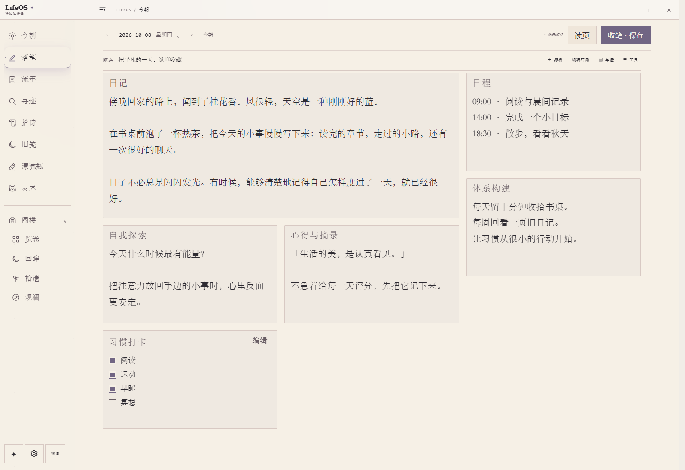

<div align="center">


# LifeOS

### 把日子写下，让记忆有回声。

<p>一个本地优先的日记与个人记忆空间。<br />在纸张般的书桌上落笔，在流年里翻页，和桌边的小伙伴一起，重逢过去的自己。</p>

[](https://github.com/DurianLoop/LifeOS/releases/tag/v0.5.2) [](#download) [](#privacy) [](LICENSE.md)

**中文** · [English](README.en.md) · [更新日志](https://github.com/DurianLoop/LifeOS/releases)

**[下载安装](#download) · [界面预览](#preview) · [功能一览](#features) · [快速开始](#quick-start) · [常见问题](#faq)**

<br />

<a href="docs/images/readme/desk.png"></a>

<sub>LifeOS v0.5.2 实际界面 · 截图文字均为虚构演示内容，不含私人日记。</sub>

</div>

<br />

LifeOS 把写作、阅读和回忆放在同一个安静的空间里。你可以只把它当作日记本，也可以导入旧日记、抽取一段往事、寄一封未来才打开的信。AI 是可选项，日常记录不需要配置模型。

<a id="download"></a>

## 下载与安装

**当前展示版本：v0.5.2。** 安装包已包含 Python 运行环境，无需另装 Python 或 Node.js。

| 平台 | 安装包 | 使用方式 |
| :--- | :--- | :--- |
| **Windows x64** | [下载 .exe](https://github.com/DurianLoop/LifeOS/releases/download/v0.5.2/LifeOS-Setup-0.5.2.exe) | 运行安装程序，从开始菜单打开 LifeOS |
| **macOS · Apple Silicon** | [下载 .dmg](https://github.com/DurianLoop/LifeOS/releases/download/v0.5.2/LifeOS-0.5.2-mac-arm64.dmg) | 适用于 M 系列芯片；拖入 Applications |
| **macOS · Intel** | [下载 .dmg](https://github.com/DurianLoop/LifeOS/releases/download/v0.5.2/LifeOS-0.5.2-mac-x64.dmg) | 适用于 Intel Mac；拖入 Applications |

[全部发行文件与校验值](https://github.com/DurianLoop/LifeOS/releases/tag/v0.5.2) · [反馈问题](https://github.com/DurianLoop/LifeOS/issues)

<details>
<summary>首次安装提示与其他平台</summary>

- Windows 社区构建尚未进行代码签名，系统可能显示 SmartScreen 提示。
- macOS 需要 **macOS 11 或更新版本**。当前构建采用 ad-hoc 签名，尚未经过 Apple 公证；核实下载来源后，可在「系统设置 → 隐私与安全性」中允许打开。
- Linux 暂无本版本的预构建安装包，可使用下方的[源码运行](#source)方式。
- 校验文件：Windows 使用 Release 中的 `SHA256SUMS.txt`，macOS 使用 `SHA256SUMS-macos-v0.5.2.txt`。

</details>

<a id="preview"></a>

## 一张书桌，几种与时间相处的方式

<table>
<tr>
<td width="50%" valign="top">
<h3>流年 · 把日子翻成一本书</h3>
<a href="docs/images/readme/journal.png"></a>
<p>按日期翻阅、从目录跳转，让散落的记录重新连成时间线。</p>
</td>
<td width="50%" valign="top">
<h3>抽签 · 与一段旧日重逢</h3>
<a href="docs/images/readme/memory.png"></a>
<p>抽一页旧日、一声回响或一条线索；打开原页，留下一枚彩笺。</p>
</td>
</tr>
<tr>
<td width="50%" valign="top">
<h3>漂流瓶 · 写给未来的自己</h3>
<a href="docs/images/readme/bottles.png"></a>
<p>把文字、声音或影像封存起来，等约定的时间再打开。</p>
</td>
<td width="50%" valign="top">
<h3>灵犀 · 有个小伙伴在身边</h3>
<a href="docs/images/readme/companion.png"></a>
<p>选择喜欢的角色，在软件内陪伴，或作为独立桌宠留在桌面。</p>
</td>
</tr>
</table>

<a id="features"></a>

## 让记录慢慢成为自己的记忆

| | 可以做什么 |
| :--- | :--- |
| **落笔与流年** | 在可拖拽、缩放的纸张上写作，以书本视图阅读；保留修订，按日期找回原页。 |
| **导入与寻迹** | 导入 Markdown、TXT、HTML、JSON、CSV 和 Day One JSON；搜索旧记录，从结果回到原文。 |
| **记忆抽签与彩笺** | 用「旧页 / 回声 / 线索」重访往事，避开近期抽过的结果；彩色书签在重启后仍然保留。 |
| **给未来的漂流瓶** | 保存文字、录音或视频草稿，设定开启时间，接收到期提醒；内容随工作区备份。 |
| **桌宠与写作氛围** | ViVi 等角色、独立桌宠、六种离线自然声；按自己的习惯排列侧栏，把暂时不用的功能收进阁楼。 |
| **可选的 AI** | 围绕日记证据提问、与以前的自己对话、文言化文字、推荐诗句或与桌宠聊天；支持模型 API、符合条件时的 CC Switch / Codex 接入，以及 Ollama Demo。 |
| **备份与恢复** | 工作区备份包含日记、附件、草稿和偏好；恢复前校验，Windows 桌面更新前保存草稿并创建安全备份。 |
| **可选择的分享** | 明确选择日记并预览后，可发布纪念页与二维码；需要单独配置托管服务。 |

### v0.5.2：重逢旧日，留下一枚彩笺

- **三种抽法**：旧页、回声、线索都带有原文入口，新保存的日记也可以立即抽取。
- **回忆有迹可循**：打开抽中的原页后，书页与目录同步留下彩色书签；可随时取消。
- **阅读更连贯**：返回抽签时保留当前结果，连续抽取避开近期结果，失败后可以重试。
- **界面更从容**：诗文模式统一使用「拾诗」「旧笺」，优化白噪音细滑条、灵犀布局与窄窗显示。

[阅读完整更新说明 →](https://github.com/DurianLoop/LifeOS/blob/v0.5.2/docs/RELEASE_v0.5.2.md)

<a id="quick-start"></a>

## 从第一篇日记开始

1. **安装并打开 LifeOS。** 在欢迎页选择写下第一篇、导入旧日记，或先四处看看。
2. **在「落笔」里记录今天。** 保存后，到「流年」中翻阅；有旧日记也可以先导入。
3. **布置自己的书桌。** 选择桌宠、打开自然声，按习惯整理侧栏。
4. **想用 AI 时再配置。** 从侧栏底部进入「AI 设置」，选择服务商并保存、测试连接。Ollama 用户需先在本机安装 Ollama 并下载模型。

[产品使用说明](https://github.com/DurianLoop/LifeOS/blob/v0.5.2/docs/PRODUCT_HELP.md) · [AI 设置与接入](https://github.com/DurianLoop/LifeOS/blob/v0.5.2/docs/AI设置与Codex接入.md) · [Ollama Demo](https://github.com/DurianLoop/LifeOS/blob/v0.5.2/docs/OLLAMA_DEMO.md)

<a id="privacy"></a>

## 日记留在本机，连接由你选择

发行包从空白工作区开始。日记原文、附件、修订与设置保存在本机，基础写作、阅读、搜索和自然声不依赖 AI 服务。

| 当你使用… | 数据如何流动 |
| :--- | :--- |
| 本地写作、阅读、搜索 | 在本机工作区处理。 |
| AI 日记问答 / 以前的我 | 向你配置的模型发送本次问题及所选日记证据。 |
| AI 文言化 / 个性化荐诗 | 发送本次文字或当天日记等相关输入；自动荐诗需单独开启，开启后可自动发送当日正文。 |
| 桌宠聊天 | 使用当前聊天与按需匹配的公开产品指南，不读取日记正文。 |
| 公开纪念页 | 只有明确选定并发布的快照会上线；之后修改日记不会自动更新公开页。 |

云端模型会接收相应请求内容。Ollama Demo 可使用本机模型，模型需要自行下载；LifeOS 安装包不包含大模型。

**桌面安装版的工作区位置：**

- Windows：`%APPDATA%/LifeOS/workspace/`
- macOS：`~/Library/Application Support/LifeOS/workspace/`

建议定期使用工作区备份，保存到另一块磁盘。源码运行默认使用项目目录。公开纪念页的部署与撤回方式见[纪念页与二维码](https://github.com/DurianLoop/LifeOS/blob/v0.5.2/docs/纪念页与二维码.md)。

<a id="faq"></a>

## 常见问题

<details>
<summary><strong>不配置 AI，可以正常使用吗？</strong></summary>

可以。写作、阅读、搜索、统计、白噪音和规则分析不依赖文本模型。需要生成内容时，再启用对应 AI 功能即可。

</details>

<details>
<summary><strong>能把已有日记迁移进来、再导出去吗？</strong></summary>

内置导入器支持 Markdown、TXT、HTML、通用 JSON、CSV 和 Day One JSON。可导出 Markdown、JSON、CSV；完整附件、草稿及设置请使用工作区备份。不同来源的字段可能有差异，导入后可到流年中核对原文。

</details>

<details>
<summary><strong>漂流瓶会发给其他人吗？到时间一定会弹提醒吗？</strong></summary>

漂流瓶是本地写给未来的内容，不是与陌生人交换消息的服务。桌面提醒需要 LifeOS 仍在运行；完全退出期间不会弹出提醒，下次打开后可以查看已到期的瓶子。

</details>

<details>
<summary><strong>关闭主窗口后，桌宠可以留下吗？</strong></summary>

可以。在灵犀设置中选择独立桌面模式，并开启关闭主窗口后保留桌宠。可以通过托盘重新打开 LifeOS，或完全退出应用。

</details>

<details>
<summary><strong>为什么源码运行要指定版本？</strong></summary>

仓库的 main 首页介绍当前发行版，main 中的应用源码仍是较早版本。要体验本页展示的功能，请下载 v0.5.2 安装包，或按下方命令检出 v0.5.2 源码。

</details>

<a id="source"></a>

## 从源码运行

需要 **Python 3.11+、Node.js 20+ 和 Git**。请显式检出本页对应的发行版本：

```bash
git clone --branch v0.5.2 --depth 1 https://github.com/DurianLoop/LifeOS.git
cd LifeOS
```

Windows：

```powershell
.\setup_desktop.bat
```

macOS / Linux：

```bash
bash setup_desktop.sh
```

安装脚本创建独立的 `desktop/.venv` 环境并检查 Electron。之后使用 `start_desktop.bat` / `bash start_desktop.sh` 启动；只安装不启动时，向 setup 脚本追加 `--no-launch`。

<details>
<summary>浏览器模式与自行构建</summary>

浏览器模式需先安装 `requirements.txt`，再运行 `start.bat` / `bash start.sh`。

构建 Windows 安装包时，将 x64 CPython 运行环境放入 `desktop/python-runtime/`，在该环境安装 `requirements.txt` 和 Pillow；嵌入式 Python 还需在 `._pth` 中启用 `import site` 与 `Lib/site-packages`。然后执行：

```powershell
cd desktop
npm ci
npm run dist:win -- --publish=never
```

产物位于 `desktop/dist/`。不要把本机工作区、密钥、运行环境或构建产物加入 Git。

</details>

## 许可与致谢

LifeOS 应用代码采用[个人、非商业用途许可](LICENSE.md)。桌宠素材保留各自作者的署名与许可，使用前请查看[对应版本的素材目录](https://github.com/DurianLoop/LifeOS/tree/v0.5.2/app/assets/pets)；自然声音频的来源见[声音与许可](https://github.com/DurianLoop/LifeOS/blob/v0.5.2/docs/WHITE_NOISE.md)。

感谢桌宠作者与所有反馈、试用 LifeOS 的朋友。如果这个小小的书桌对你有帮助，欢迎给项目一颗 Star，也欢迎[提交问题与建议](https://github.com/DurianLoop/LifeOS/issues)。

<div align="center">

<br />

**写下此刻，留给以后的自己。**

[下载 LifeOS](#download) · [回到顶部](#lifeos)

</div>
