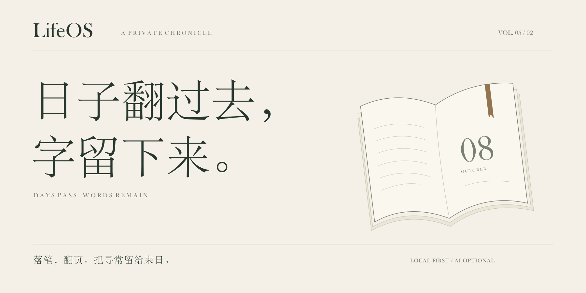

<a id="lifeos"></a>

<picture>
  <source media="(prefers-color-scheme: dark)" srcset="docs/images/readme/editorial/cover-dark.svg" />
  
</picture>

<p align="center"><strong>LifeOS</strong> · 本地优先的日记与个人记忆空间</p>
<p align="center"><sub><a href="https://github.com/DurianLoop/LifeOS/releases/tag/v0.5.2">v0.5.2</a> &nbsp; / &nbsp; Windows · macOS &nbsp; / &nbsp; AI 可选</sub></p>
<p align="center"><a href="#download">下载</a> &nbsp; · &nbsp; <a href="#preview">翻阅</a> &nbsp; · &nbsp; <a href="#privacy">关于私密</a> &nbsp; · &nbsp; <a href="#source">源码</a> &nbsp; · &nbsp; <a href="README.en.md">English</a></p>

<br />

<p align="center">一顿饭，一段路，一个还没想清楚的念头。<br />值得写下的，往往就是这些。</p>
<p align="center">LifeOS 留出一张书桌。你写下今天，也把这一页留给以后的自己。</p>

<br />

<a id="preview"></a>
<a id="features"></a>

<sub>01 &nbsp; / &nbsp; 落笔</sub>

## 一页纸，容得下寻常。

把今天慢慢写下来。纸页可以拖动、缩放，日程、摘录与随手记各有一角。保存后的文字留有修订，想读的时候，就翻回原来的那一页。

<a href="docs/images/readme/desk.png"></a>

<sub>可自由布置的书桌 · 草稿与修订保留 · 旧日记可导入</sub>

<br />
<br />

<sub>02 &nbsp; / &nbsp; 流年</sub>

## 翻过的日子，也可以再读。

沿着日期，读一读过去的自己。也可以把选择交给「记忆抽签机」：一页旧日、一声回响，或一条把往事连起来的线索。打开原文，留下一枚彩笺。

<a href="docs/images/readme/journal.png"></a>

<sub>v0.5.2 · 旧页 / 回声 / 线索 · 原文入口 · 重启后仍在的彩色书签</sub>

<details>
<summary>翻开另一页：记忆抽签</summary>


新保存的日记可立即抽取，连续抽取避开近期结果。返回抽签时保留当前一页，彩笺可以随时取消。[本版更新说明 →](https://github.com/DurianLoop/LifeOS/blob/v0.5.2/docs/RELEASE_v0.5.2.md)

</details>

<br />
<br />

<sub>03 &nbsp; / &nbsp; 寄远</sub>

## 有些话，留待以后再读。

写一封信，留一段声音，或封存此刻的影像。约定一个开启的日期，再把它交给时间。等未来的你打开，还能听见今天的语气。

<a href="docs/images/readme/bottles.png"></a>

<sub>文字 · 录音 · 视频 · 定时开启 · 到期提醒</sub>

<br />
<br />

<sub>04 &nbsp; / &nbsp; 相伴</sub>

## 桌旁有伴，窗外有声。


选一个喜欢的小伙伴，让它待在纸页旁，或住进桌面的一角。打开一段雨声，把暂时不用的功能收进阁楼。书桌可以按你的习惯慢慢布置。

六段自然声随应用提供，可离线播放。ViVi 等角色支持软件内陪伴与独立桌宠；关闭主窗口后，也可以让桌宠留下。

<details>
<summary>看看这间小小的灵犀居所</summary>


角色素材保留原作者的署名与许可；[ViVi 来源说明](docs/images/readme/editorial/VIVI-LICENSE.md)。

</details>

<br clear="all" />
<br />

<a id="privacy"></a>

## 私人的文字，先留在自己的房间。

日记、附件、修订与设置保存在本机。写作、阅读、搜索与自然声不需要连接模型；需要整理思绪时，再选择 AI 日记问答、以前的我、文言化或诗句推荐。

**接入云端 AI 时，相应的提问与文字会发送给你配置的服务。** Ollama Demo 可连接本机模型，需自行安装 Ollama 并下载模型。公开纪念页则需要选定内容、预览并主动发布。

<details>
<summary>哪些内容会发送给 AI？</summary>

- 日记问答与「以前的我」：本次问题及所选日记证据。
- 文言化：本次提交的文字。
- 个性化荐诗：当天日记等相关输入。自动荐诗需单独开启，开启后可自动发送当日正文。
- 桌宠聊天：当前聊天与按需匹配的公开产品指南，不读取日记正文。

可连接模型 API、符合条件时的 CC Switch / Codex 配置，或 Ollama Demo。安装包不含大模型。[AI 设置说明](https://github.com/DurianLoop/LifeOS/blob/v0.5.2/docs/AI设置与Codex接入.md) · [Ollama Demo](https://github.com/DurianLoop/LifeOS/blob/v0.5.2/docs/OLLAMA_DEMO.md)

</details>

<details>
<summary>日记放在哪里，怎样备份与分享？</summary>

Windows 安装版的工作区位于 `%APPDATA%/LifeOS/workspace/`；macOS 位于 `~/Library/Application Support/LifeOS/workspace/`。源码运行默认使用项目目录。

工作区备份包含日记、修订、附件、草稿、偏好和漂流瓶媒体，建议保存到另一块磁盘。恢复前会进行校验，恢复操作需重启。Windows 桌面更新会先保存草稿并创建安全备份；macOS 升级可重新下载安装包。

公开纪念页需要另行配置托管服务。只有明确选择并发布的快照会上线，之后修改日记不会自动更新公开页；可撤回已发布内容。[纪念页与二维码 →](https://github.com/DurianLoop/LifeOS/blob/v0.5.2/docs/纪念页与二维码.md)

</details>

<br />

<a id="download"></a>
<a id="quick-start"></a>

## 从今天这一页开始。

**[Windows x64 ↗](https://github.com/DurianLoop/LifeOS/releases/download/v0.5.2/LifeOS-Setup-0.5.2.exe)** &nbsp; / &nbsp; **[macOS · Apple Silicon ↗](https://github.com/DurianLoop/LifeOS/releases/download/v0.5.2/LifeOS-0.5.2-mac-arm64.dmg)** &nbsp; / &nbsp; **[macOS · Intel ↗](https://github.com/DurianLoop/LifeOS/releases/download/v0.5.2/LifeOS-0.5.2-mac-x64.dmg)**

v0.5.2 · 安装包已包含运行环境，无需另装 Python 或 Node.js。

安装后，可以写下第一篇，也可以导入旧日记。AI 不必现在配置，先让今天有个落脚处。

[全部发行文件与校验值](https://github.com/DurianLoop/LifeOS/releases/tag/v0.5.2) &nbsp; · &nbsp; [使用说明](https://github.com/DurianLoop/LifeOS/blob/v0.5.2/docs/PRODUCT_HELP.md) &nbsp; · &nbsp; [问题与建议](https://github.com/DurianLoop/LifeOS/issues)

<details>
<summary>安装说明</summary>

- **Windows x64**：运行 `.exe` 安装程序，从开始菜单打开 LifeOS。社区构建未进行代码签名，可能出现 SmartScreen 提示。
- **macOS 11+**：选择对应芯片的 `.dmg`，将 LifeOS 拖入 Applications。当前为 ad-hoc 签名，未经 Apple 公证；核实下载来源后，可在「系统设置 → 隐私与安全性」中允许打开。
- **Linux**：本版本暂无预构建安装包，可从源码运行。
- **校验值**：Release 提供 `SHA256SUMS.txt`（Windows）和 `SHA256SUMS-macos-v0.5.2.txt`（macOS）。

</details>

<a id="faq"></a>

<details>
<summary>导入、导出与使用上的几个问题</summary>

**已有日记能迁移进来吗？**

支持 Markdown、TXT、HTML、通用 JSON、CSV 和 Day One JSON。导入后可到流年中核对日期与原文。

**导出和备份有什么区别？**

导出提供当前日记的 Markdown、JSON 或 CSV；要保留修订、附件、草稿、偏好和漂流瓶媒体，请使用完整工作区备份。

**漂流瓶会寄给其他人吗？**

它是本地写给未来的内容，不是陌生人交换消息的服务。到期提醒需要 LifeOS 正在运行；完全退出时不会弹出提醒，下次打开可查看已到期的瓶子。

**关闭窗口后，桌宠怎样留下？**

在灵犀设置中选择独立桌面模式，并开启关闭主窗口后保留桌宠。托盘可以重新打开 LifeOS，也可以完全退出。

</details>

<a id="source"></a>

<details>
<summary>源码运行与构建</summary>

**main 首页介绍 v0.5.2，main 的应用源码仍是较早版本。** 要体验本页展示的功能，请使用发行版安装包，或显式检出 v0.5.2。环境要求：Python 3.11+、Node.js 20+、Git。

```bash
git clone --branch v0.5.2 --depth 1 https://github.com/DurianLoop/LifeOS.git
cd LifeOS
```

Windows：

```powershell
.\setup_desktop.bat
```

macOS / Linux：

```bash
bash setup_desktop.sh
```

安装脚本创建独立的 `desktop/.venv` 环境并检查 Electron。后续使用 `start_desktop.bat` / `bash start_desktop.sh` 启动；向 setup 脚本追加 `--no-launch` 可只安装不启动。

浏览器模式先安装 `requirements.txt`，再运行 `start.bat` / `bash start.sh`。

构建 Windows 安装包需在 `desktop/python-runtime/` 放入 x64 CPython，并在该环境安装 `requirements.txt` 和 Pillow。嵌入式 Python 需在 `._pth` 中启用 `import site` 与 `Lib/site-packages`，然后执行：

```powershell
cd desktop
npm ci
npm run dist:win -- --publish=never
```

产物位于 `desktop/dist/`。本机工作区、密钥、运行环境与构建产物不应加入 Git。

</details>

<br />

---

<sub>应用代码采用[个人、非商业用途许可](LICENSE.md)。[桌宠素材](https://github.com/DurianLoop/LifeOS/tree/v0.5.2/app/assets/pets)与[自然声音频](https://github.com/DurianLoop/LifeOS/blob/v0.5.2/docs/WHITE_NOISE.md)保留各自署名与许可。感谢这些创作者，也感谢每一位把 LifeOS 带进日常的人。</sub>

<sub>展示基于 v0.5.2 实际界面，文字均为虚构演示内容。展示板包含裁切与排版，点击可查看原图。[截图与设计来源](docs/images/readme/CAPTURE.md)。</sub>

<br />

<p align="center">写到这里，今天便有了形状。</p>
<p align="center"><sub>LifeOS &nbsp; / &nbsp; A private chronicle.</sub></p>
<p align="center"><sub><a href="#lifeos">回到扉页 ↑</a></sub></p>
