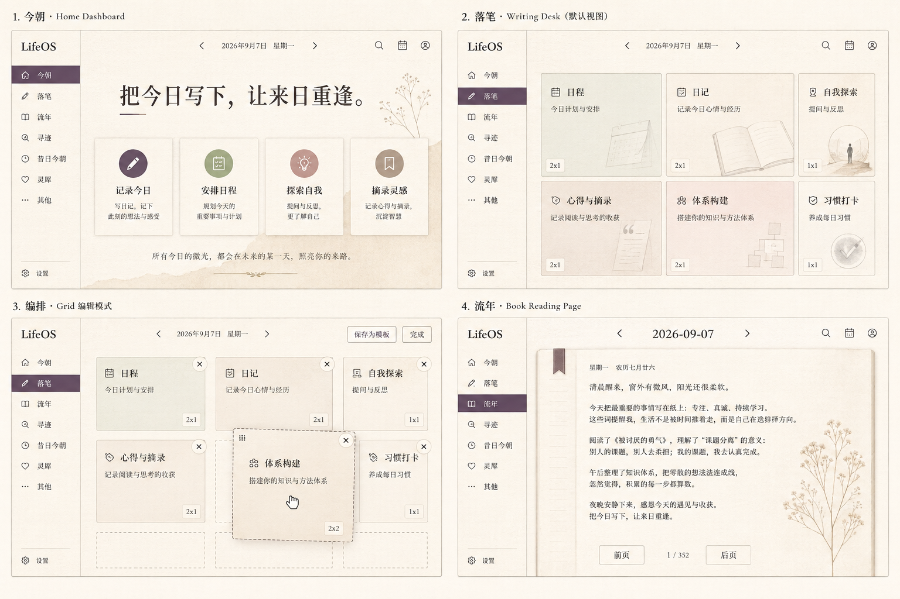

# LifeOS v0.2.2 升级方案与产品需求文档

> 文档状态：待评审
> 版本：v0.2.2
> 基线：v0.2.0 当前工作区版本
> 编写日期：2026-09-07
> 目标：稳定现有体验、统一视觉与交互、完成可截图验收的发布版本

## 1. 版本定位

v0.2.2 是一次“体验收口版”，不是功能堆叠版。

本版本不再扩张新的产品模块，重点解决当前版本中最影响日常使用的问题：

- 页面之间的交互规则不够统一；
- 字体、间距、滚动条和控件样式没有完全跟随主题；
- 编排格子在不同屏幕和缩放比例下容易错位；
- 日期、保存、返回、拖动等关键操作需要更明确的状态反馈；
- 空白页面存在多余提示文字，影响阅读；
- 某些页面的弹窗和辅助面板仍然打断用户当前任务。

## 2. 产品目标

### 2.1 核心目标

让用户可以在不学习复杂规则的情况下完成以下路径：

1. 打开“今朝”；
2. 通过日期快速进入某一天；
3. 点击格子进入对应内容；
4. 直接书写、格式化、保存；
5. 回到“流年”翻阅历史；
6. 在需要时调整格子顺序、尺寸和习惯内容。

### 2.2 成功指标

| 指标 | v0.2.2 目标 |
| --- | --- |
| 首次进入今朝后找到落笔入口 | 3 秒内 |
| 从顶部日期跳转到指定日期 | 1 次提交完成 |
| 保存并退出 | 1 次点击完成 |
| 编排格子顺序 | 鼠标拖动完成，且不触发格子跳转 |
| 393px 窄屏横向溢出 | 0 处 |
| 浏览器 100% / 125% / 150% 缩放下关键控件可操作 | 100% |
| P0 / P1 验收用例通过率 | 100% |

## 3. 非目标

本版本暂不包含：

- 云同步、账号体系和多人协作；
- AI 自动总结或自动生成内容；
- 新增独立的复杂编辑器；
- 桌宠离线安装包和完整桌宠运行时；
- 大规模重写现有数据结构；
- 为了视觉效果增加新的弹窗、抽屉或多级菜单。

## 4. 用户与主要场景

### 4.1 目标用户

需要长期记录、回看和整理个人生活的桌面端用户。用户更关心“快速留下真实内容”，而不是配置复杂的笔记系统。

### 4.2 高频场景

#### 场景 A：今天快速落笔

用户进入“今朝”，点击“落笔”，在日记格子中输入内容，使用加粗、下划线或标签，点击“收笔·保存”，回到原页面。

#### 场景 B：回看某一天

用户点击顶部日期，输入或选择具体年月日，进入对应页面；在“流年”中使用前页、后页或书页按钮阅读历史内容。

#### 场景 C：整理工作台

用户点击“编排”，拖动格子改变顺序，修改格子标题、样式和尺寸，点击“保存为模板”，再次进入时布局仍然保留。

#### 场景 D：每日习惯记录

用户将“习惯打卡”作为普通格子进入，在格子内部完成勾选、增加习惯、修改名称和补充说明，不再使用右侧独立模块。

## 5. 设计原则

### 5.1 原文优先

页面优先呈现用户写下的内容。没有内容时留白，不显示“留给之后的自己”“从一件真事开始”等占位文案。

### 5.2 一次点击完成主要动作

保存、返回、日期跳转、进入格子、退出编排都应尽量一次完成。只有删除、清空等不可逆动作可以使用确认机制。

### 5.3 状态在原位置反馈

优先使用按钮颜色、边框、短暂文字变化和轻量 toast 反馈，不额外弹出遮挡当前内容的窗口。

### 5.4 编辑与阅读分离

普通阅读状态保持安静；进入编辑或编排后，才显示对应的控件。完成操作后自动收起冗余工具。

### 5.5 所有尺寸跟随同一套系统

字号、行高、间距、按钮高度、格子内边距和滚动条均使用统一设计变量，禁止单独写死一套不跟随缩放的尺寸。

## 6. 功能需求

### 6.1 今朝首页

#### 需求

- 保持首页作为默认入口；
- 保留主标题、继续书写、流年、寻迹和昔日今朝入口；
- 四个入口块保持同一视觉语言，但通过编号、标题和动作形成差异；
- 首页不显示无实际作用的解释性长文案；
- 桌宠只作为轻量陪伴入口，不遮挡核心内容。

#### 验收标准

- 首屏能看见主标题和至少一个主要行动按钮；
- 1280px、1536px 宽度下主内容保持居中，左右留白均衡；
- 393px 窄屏下按钮不横向溢出；
- 点击首页四个入口后均能进入正确页面，并在操作后截图确认。

### 6.2 顶部日期导航

#### 需求

- 顶部中间显示当前日期；
- 日期区域可直接交互，支持快速跳转到某年某月某日；
- 不再在日期右侧显示多余的“选日期”标示；
- 前一天、后一天按钮保持可用；
- 切换日期后，页面标题、格子内容和日期状态同时更新；
- 不因日期控件展开导致页面布局抖动或遮挡关键按钮。

#### 验收标准

- 输入 `2026-09-06` 后一次提交即可进入 9 月 6 日；
- 点击次日后进入 9 月 7 日；
- 在 100% / 125% / 150% 缩放下日期输入框仍可点击、可输入、可提交；
- 日期切换前后分别截图，且截图中的日期、正文和导航状态一致。

### 6.3 落笔页面

#### 需求

- “落笔”使用沉浸式桌面布局，减少两侧无意义空白；
- 默认字号为“大·默认”，整体字号比 v0.1 明显增大；
- 顶部只保留日期、返回、阅读和保存等核心操作；
- 空白格子只保留标题与留白，不显示占位提示；
- 点击普通格子进入编辑状态，不跳转到额外弹窗；
- 编辑状态下支持加粗、下划线、标签、引用和待办等轻量格式；
- 点击“收笔·保存”一次完成保存并返回；
- 保存过程显示短暂的原位状态反馈。

#### 验收标准

- 进入落笔后 1.5 秒内显示完整可操作页面；
- 空白格子内没有冗余占位句；
- 输入内容、格式化、保存、返回均可在一次操作中完成；
- 页面正文区可滚动，格子内部按需求滚动，但不显示突兀的独立滚动条；
- 全屏状态下内容区域能自适应变宽，顶部操作点位不被格子高度遮挡。

### 6.4 格子系统与编排

#### 需求

- 格子以直接交互为主，不再依赖细长的新增下拉窗口；
- 普通状态下点击格子进入对应内容；
- 编排状态下：
  - 每个格子右上角显示一个轻量 `×`；
  - 点击标题可以直接改名；
  - 可选择样式：纸张、浅洗、墨色；
  - 可选择尺寸：`1x1`、`1x2`、`2x1`、`2x2`；
  - 可拖动格子调整先后顺序；
  - 拖动过程中不触发进入格子；
  - 拖动结束后立即保存新顺序；
  - 保持自适应排版，不能因为某一个格子高度导致顶部操作点不到；
  - 隐藏格子后可以恢复；
  - 支持保存、套用和删除布局模板。
- 尺寸展示统一使用 `1x1` 这样的格式，不使用 `1*1` 或混合写法。

#### 验收标准

- 编排开关打开后截图，确认所有格子的编辑控件出现；
- 从第一格拖到第三格，截图并核对 DOM 顺序和视觉顺序一致；
- 拖动过程中不打开格子编辑；
- 修改标题后退出编排，截图确认标题已保留；
- 修改尺寸后在桌面和窄屏分别截图；
- 保存模板后刷新页面，截图确认模板仍可套用；
- 普通状态下编辑控件全部隐藏；
- 所有格子的滚动条轨道与滑块不可见，但滚轮、触控板和触摸滚动仍可用。

### 6.5 习惯打卡格子

#### 需求

- “习惯打卡”作为与日程、日记一致的普通格子；
- 可以通过格子右上角的“编辑”进入编辑状态；
- 用户可以新增、删除、重命名习惯；
- 每条习惯可以勾选；
- 补充说明支持普通文本和轻量格式；
- 习惯格子的字号、行高、内边距和控件大小全部跟随系统字体设置；
- 习惯内容在窄屏下自动换行，不出现挤压、截断或横向滚动。

#### 验收标准

- 习惯格子和其他格子在尺寸、边界、标题层级上保持一致；
- 修改习惯名称后截图确认；
- 勾选一条习惯后截图确认视觉反馈；
- 在 393px、1280px、150% 缩放下分别截图；
- 习惯编辑输入框宽度始终适配格子，不出现窄条输入框。

### 6.6 日 / 周 / 月 / 年视图

#### 需求

- 四种视图保留同一内容基础，但在结构和视觉密度上做出差异；
- 日：聚焦当天的完整格子内容；
- 周：聚合一周内容，突出日期分组；
- 月：使用月度网格或摘要布局，突出整体节奏；
- 年：使用年度概览，突出月份、次数和长期趋势；
- 切换视图后保留当前日期上下文；
- 不允许出现点击后无内容变化的“伪切换”。

#### 验收标准

- 日、周、月、年四种状态各截图一次；
- 截图中能明显区分标题、布局密度和日期范围；
- 切换过程中无额外弹窗；
- 切换后仍能进入格子或返回上一层。

### 6.7 流年与翻页阅读

#### 需求

- “流年”保持独立阅读页面；
- 采用“书页”式的前页 / 后页交互；
- 保留“原页为先”的副标题；
- 历史条目显示日期与标题，避免重复日期；
- 读取富文本时必须渲染为视觉格式，不得出现原始 HTML 标签；
- 没有内容的区域保持留白；
- 翻页按钮在首尾页正确禁用。

#### 验收标准

- 打开流年截图；
- 点击前页截图；
- 点击后页截图；
- 点击原文页截图；
- 检查页面文本中不存在裸露的 `<b>`、`<u>`、`<strong>` 等标签；
- 首页、末页按钮状态符合当前页位置。

### 6.8 寻迹、昔日今朝与其他

#### 需求

- 寻迹使用搜索输入、筛选和结果列表，不显示原始标签；
- 昔日今朝显示历史关联内容，并能回到原页；
- “其他”作为普通主题页面，不使用可关闭的弹窗代替页面；
- “其他”页面保留副标题；
- 其他工具使用统一卡片样式，减少冗余图标和说明文字；
- Timeline 等工具打开后仍保持主题、滚动条和字号系统一致。

#### 验收标准

- 寻迹输入关键词并截图结果；
- 昔日今朝打开一条内容并截图；
- 其他页面截图；
- 从其他进入 Timeline 并截图；
- 关闭或返回后不残留遮罩、弹窗或旧页面内容。

### 6.9 字体大小与自适应

#### 需求

- 设置中提供：
  - `大·默认`；
  - `大`；
  - `特大`。
- 默认使用 `大·默认`；
- 所有文本统一通过字号变量缩放，包括：
  - 页面标题；
  - 正文；
  - 格子标题；
  - 习惯条目；
  - 按钮；
  - 导航；
  - 日期；
  - 设置项；
  - 提示和状态文字。
- 缩放后自动调整行高、格子高度、按钮宽度和布局断点；
- 不允许只放大部分文本而留下不可读的小文本。

#### 验收标准

- 默认、大、特大分别截图；
- 对比截图确认标题、正文、格子、习惯和导航同步变化；
- 100% / 125% / 150% 浏览器缩放下关键控件仍可操作；
- 393px 下字号增大后不出现横向溢出。

### 6.10 滚动与滚动条

#### 需求

- 页面滚动条、阅读区域滚动条和格子内部滚动保持主题色；
- 格子内部允许上下滚动，不把滚动事件传递为整个页面滚动；
- 编排拖动时暂时锁定不必要的滚动跳转；
- 滚动条视觉尽量弱化，格子内部不显示明显独立滚动条；
- 键盘、鼠标滚轮、触控板和触摸操作保持可用。

#### 验收标准

- 页面整体向下滚动截图；
- 格子内部滚动截图；
- 格子内部滚动后页面位置不发生异常跳转；
- 编排拖动时不触发页面跳动；
- 窄屏下没有横向滚动条。

## 7. 视觉规范

### 7.1 视觉方向

关键词：安静、留白、纸张、可读、克制。

保留当前 LifeOS 的纸张感与低饱和主题，不新增高饱和装饰，不使用无功能的阴影和边框。

### 7.2 层级规范

| 层级 | 用途 | 规则 |
| --- | --- | --- |
| L1 | 页面主标题 | 最大字号，单页只保留一个视觉焦点 |
| L2 | 格子标题 / 日期标题 | 稳定、清楚，避免和正文混淆 |
| L3 | 正文 | 优先可读性，跟随字号系统 |
| L4 | 辅助信息 | 低对比度、短文本，不承担主要操作 |
| L5 | 状态反馈 | 只在状态发生时出现，完成后自动淡出 |

### 7.3 控件规范

- 普通按钮：轻边框、主题底色、明确 hover / active 状态；
- 主按钮：只保留给当前页面最重要的动作；
- 删除：使用 `×` 或垃圾桶语义，不使用复杂确认弹窗；
- 设置：优先使用页内控件或轻量侧栏；
- 图标：只在能帮助识别动作时使用；
- 同一页面内不同时使用多套按钮高度和圆角规则。

## 8. 响应式与缩放规格

### 8.1 验收尺寸

| 环境 | 目标 |
| --- | --- |
| 桌面标准 | 1280 × 720 |
| 桌面宽屏 | 1536 × 864 |
| 窄屏 | 393 × 852 或实际可用高度 |
| 浏览器缩放 | 100%、125%、150% |

### 8.2 布局要求

- 桌面端主内容保持居中，左右留白尽量对称；
- 宽屏端内容区可以增加宽度，但不无限拉伸文字行；
- 窄屏端格子默认单列；
- 格子高度变化不得遮挡顶部导航和操作按钮；
- 所有输入框、选择框和按钮至少保持可视、可聚焦、可点击；
- 不以隐藏内容代替真正的自适应。

## 9. 截图验收协议

从 v0.2.2 开始，所有界面升级必须遵循以下协议。

### 9.1 每个功能块的截图节点

每个功能块至少截图三次：

1. 初始状态：进入页面后的稳定画面；
2. 交互状态：点击、输入、拖动或打开编辑后的画面；
3. 完成状态：保存、返回、切换或提交后的最终画面。

如果功能涉及响应式，还必须在窄屏和至少一个浏览器缩放比例下重复截图。

### 9.2 截图命名

建议统一保存为：

```text
qa/v0.2.2/<功能块>/<序号>_<视口>_<状态>.png
```

示例：

```text
qa/v0.2.2/grid/01_1280_normal.png
qa/v0.2.2/grid/02_1280_arrange.png
qa/v0.2.2/grid/03_1280_dragged.png
qa/v0.2.2/grid/04_393_responsive.png
```

### 9.3 截图验收记录

每个功能块必须同时记录：

- 操作步骤；
- 截图路径；
- 预期结果；
- 实际结果；
- 通过 / 不通过；
- 若不通过，记录复现条件和下一步修复计划。

## 10. 全量测试矩阵

| 模块 | 核心测试 | 桌面 1280 | 宽屏 1536 | 窄屏 393 | 125% / 150% |
| --- | --- | ---: | ---: | ---: | ---: |
| 今朝 | 首页入口、卡片、自适应 | ✓ | ✓ | ✓ | ✓ |
| 落笔 | 日期、输入、富文本、保存 | ✓ | ✓ | ✓ | ✓ |
| 编排 | 改名、删除、拖动、尺寸、模板 | ✓ | ✓ | ✓ | ✓ |
| 习惯 | 勾选、编辑、新增、字号 | ✓ | ✓ | ✓ | ✓ |
| 日周月年 | 视图切换与内容范围 | ✓ | ✓ | ✓ | ✓ |
| 流年 | 翻页、原文、富文本 | ✓ | ✓ | ✓ | ✓ |
| 寻迹 | 搜索、高亮、结果进入 | ✓ | ✓ | ✓ | ✓ |
| 昔日今朝 | 历史内容、原页返回 | ✓ | 选测 | ✓ | 选测 |
| 灵犀 | 预览目录、滚动 | ✓ | 选测 | ✓ | 选测 |
| 其他 | 页面进入、Timeline、返回 | ✓ | ✓ | ✓ | ✓ |
| 设置 | 字号、主题、滚动条 | ✓ | ✓ | ✓ | ✓ |

## 11. 实施流程

### 阶段 0：需求冻结

- 评审本 PRD；
- 确定本版本不新增范围外功能；
- 建立验收用例和截图目录；
- 标记当前已知问题。

产出：PRD 评审记录、测试清单、问题基线截图。

### 阶段 1：视觉与交互基础

- 统一字号、颜色、间距和滚动条变量；
- 统一按钮、输入框、卡片和状态反馈；
- 先解决桌面与窄屏的布局骨架；
- 不接入新功能，先截图确认基础视觉。

产出：视觉基线截图、响应式基线截图。

### 阶段 2：核心路径开发

按以下顺序开发：

1. 日期与导航；
2. 落笔与保存；
3. 格子编排；
4. 习惯格子；
5. 日周月年；
6. 流年与其他页面。

每完成一个模块，立即进行“操作前 / 操作中 / 操作后”截图验收，不把多个模块堆到最后统一验证。

### 阶段 3：真实用户回归

- 使用真实鼠标点击和拖动；
- 使用键盘输入、滚轮、触控板和窄屏触摸模拟；
- 逐个检查日期、格子、按钮、输入框是否被遮挡；
- 在 100%、125%、150% 缩放下重复关键路径；
- 发现问题后先补复现截图，再修复，再补验证截图。

### 阶段 4：发布前验收

- 完成全量测试矩阵；
- 汇总所有截图；
- 检查是否存在裸露 HTML 标签、占位符和多余弹窗；
- 检查是否存在横向溢出、无法点击和保存二次点击问题；
- 执行静态检查和构建检查；
- 冻结代码后再生成版本说明。

## 12. 缺陷等级与发布门槛

### P0：必须阻止发布

- 页面无法打开或白屏；
- 保存失败、数据丢失；
- 日期跳转到错误日期；
- 编排拖动导致内容跳转或顺序丢失；
- 关键按钮在某个目标视口不可点击；
- 出现横向溢出导致核心内容不可用。

### P1：必须修复后发布

- 字号只影响部分区域；
- 习惯格子布局错位；
- 流年翻页状态错误；
- 弹窗遮挡内容；
- 富文本显示原始标签；
- 主题滚动条缺失或风格不一致。

### P2：可记录到后续版本

- 非核心间距轻微不一致；
- 非核心文案需要进一步润色；
- 桌宠动画细节优化；
- 极少数低频页面的装饰性问题。

发布要求：P0 为 0，P1 为 0，P2 必须有明确记录和后续版本归属。

## 13. 技术实现约束

- 继续使用现有本地数据结构，避免无必要迁移；
- 所有用户可见文本使用现有多语言机制；
- 所有字号使用统一 CSS 变量或等价的集中配置；
- 拖动同时支持鼠标和 Pointer Events；
- 不使用只能在某一个浏览器有效的专有交互；
- 交互状态必须可通过 DOM 状态和截图复核；
- 新增逻辑必须通过 JavaScript 语法检查；
- 每次界面变更后都要执行最小静态检查和对应截图回归。

## 14. v0.2.2 交付物

- 本 PRD 文件；
- 更新后的界面代码；
- 截图验收目录；
- 全量测试记录；
- 缺陷清单与关闭记录；
- v0.2.2 版本说明；
- 可运行的本地版本。

## 15. 完成定义（Definition of Done）

只有同时满足以下条件，v0.2.2 才算完成：

1. PRD 中的 P0 / P1 需求全部实现；
2. 每个功能块完成初始、交互、完成三张截图；
3. 1280px、1536px、393px 均完成关键路径验收；
4. 100%、125%、150% 缩放下关键路径可用；
5. 字体、滚动条、按钮、输入框和格子样式保持主题一致；
6. 保存、返回、日期跳转和编排拖动均通过真实操作验收；
7. 无占位符、无裸露 HTML 标签、无无意义弹窗；
8. 静态检查、构建检查和最终截图全部留档；
9. 发布前不再引入未经 PRD 评审的新功能。

## 16. 后续版本边界

v0.2.2 完成后，以下内容放入后续版本评估：

- 模板导入导出；
- 更完整的书页翻页动画；
- 桌宠预览的更多互动；
- 内容标签管理；
- 数据备份与恢复；
- 可选的更细字体和密度设置。

这些内容必须在下一版本单独建立 PRD，不能在 v0.2.2 开发过程中临时加入。

## 17. 产品界面原型与交互蓝图

本节是 v0.2.2 的界面设计基准。开发时先对照线框实现结构，再进行视觉精修；如果实际界面与线框存在结构差异，必须先更新本 PRD 并重新截图验收。

### 17.0 视觉方向总览

以下为 v0.2.2 的高保真视觉方向稿，用于统一页面气质、色彩、排版、留白和组件密度。图片是设计参考，不替代本 PRD 后续的结构线框与交互验收标准。



视觉稿重点：

- 桌面端优先，左侧导航、顶部日期和中心内容形成稳定骨架；
- 今朝、落笔、编排和流年使用同一套纸张感设计语言；
- 主色使用暖象牙、墨色、灰紫和浅鼠尾草绿，避免高饱和装饰；
- 格子保持清晰边界，但不增加厚重外框；
- 编排状态只增加必要的 `×`、尺寸标签和拖动提示；
- 流年使用轻量书页质感表达翻页，不使用遮挡内容的大弹窗；
- 最终实现需要优先保证中文可读性，生成图中的英文小标题不作为产品文案要求。

### 17.1 全局桌面端框架

目标视口：1280 × 720。左侧导航固定，内容区自适应，顶部日期始终保持可操作。

```text
┌──────────────────────────────────────────────────────────────────────────────────────────────┐
│  ☰  LifeOS · 将记忆存档             ←  2026年09月07日  →        读页       收笔·保存          │
├───────────────┬──────────────────────────────────────────────────────────────────────────────┤
│               │  LIFEOS / 当前页面                                                           │
│  ◉  今朝       │                                                                              │
│  ◇  落笔       │                         页面主内容区                                         │
│  ▣  流年       │                                                                              │
│  ⌕  寻迹       │                                                                              │
│  ◐  昔日今朝   │                                                                              │
│  ∞  灵犀       │                                                                              │
│  ⌂  其他       │                                                                              │
│               │                                                                              │
│               │                                                                              │
│  ✦   ?   微调  │                                                                              │
└───────────────┴──────────────────────────────────────────────────────────────────────────────┘
```

界面规则：

- 导航宽度约为 202px，内容区使用 `minmax(0, 1fr)`；
- 顶部日期是一个统一的交互入口，不额外放置“选日期”文字；
- 页面主内容不再套黑色外围框；
- 左右留白以内容区为基准均衡，不用固定空白撑开页面；
- 窄屏时导航收为顶部菜单，主内容切换为单列。

### 17.2 今朝首页

桌面端：首页只保留一个主标题、四个核心入口和一块轻量档案信息。

```text
┌─────────────────────────────────────────────────────────────────────────────┐
│ LIFEOS · 浮生书                                      今天住在哪里？          │
│                                                                             │
│  把今日写下，                                                               │
│  让来日重逢。                                      ┌─────────────────────┐  │
│                                                    │ 你的档案             │  │
│  今日这一页，从这里开始；过去偶尔会来敲门。        │ 日记与周记       02  │  │
│                                                    │ 历史版本         02  │  │
│  [继续写]   [翻一页·流年]   [寻迹·找一句话]        │ 今天             已写 │  │
│                                                    └─────────────────────┘  │
│                                                                             │
├──────────────────┬──────────────────┬──────────────────┬───────────────────┤
│ 01 · 落笔        │ 02 · 寻迹        │ 03 · 展卷        │ 04 · 旧信         │
│ 写                │ 找                │ 重读              │ 重逢               │
│ 今日这一页        │ 从一句话寻回      │ 旧页重开          │ 同一个今日         │
└──────────────────┴──────────────────┴──────────────────┴───────────────────┘
```

首页卡片交互：

- 整块卡片可点击；
- hover 只改变边框或底色，不出现额外弹窗；
- 点击后显示轻量 active 状态，再进入目标页面；
- 主按钮只有一个深色主按钮，其余为次级按钮。

### 17.3 落笔页面：正常状态

落笔页面是 v0.2.2 的核心工作界面。格子既是内容容器，也是进入具体内容的入口。

```text
┌─────────────────────────────────────────────────────────────────────────────┐
│ ← 归页          ←      9月7日星期一       →        读页    收笔·保存          │
├───────────────┬─────────────────────────────────────────────────────────────┤
│ 07            │                                                             │
│ 9月7日星期一   │  写作视图                         ▦ 编排    ▤ 章法           │
│               │                                                             │
│ 写作视图       ├───────────────────────────────┬─────────────────────────────┤
│ [日][周][月][年]│ 日程                          │ 日记                        │
│               │                               │                             │
│               │ 测试格式                      │                             │
│               │                               │                             │
│               ├───────────────┬───────────────┼─────────────────────────────┤
│               │ 自我探索       │ 心得与摘录     │ 体系构建                    │
│               │               │               │                             │
│               │               │               │                             │
│               ├───────────────┴───────────────┴─────────────────────────────┤
│               │ 习惯打卡                         编辑                         │
│               │ □ 阅读 / 学习 / 输出     □ 散步 / 吉他 / 运动                 │
│               │ □ 电影 / 影评 / 辩论     □ 照顾好自己                         │
└───────────────┴─────────────────────────────────────────────────────────────┘
```

正常状态要求：

- 格子标题使用 L2 层级，正文使用 L3 层级；
- 空白格只显示标题和留白，不出现占位句；
- “习惯打卡”与其他格子的尺寸、边距、标题位置一致；
- 格子正文区域可独立上下滚动，但不显示突兀的滚动条；
- 点击格子正文后只在原地进入编辑态，不打开新窗口。

### 17.4 落笔页面：编排状态

编排不是一个复杂设置页，而是在当前工作台上直接编辑。

```text
┌─────────────────────────────────────────────────────────────────────────────┐
│ ← 归页          ←      9月7日星期一       →        读页    收笔·保存          │
├─────────────────────────────────────────────────────────────────────────────┤
│                         编排中                         保存为模板             │
│                                                                             │
│ ┌────────────────────────────┐ ┌──────────────────────────────────────────┐ │
│ │ 日程                    ×  │ │ 日记                                  × │ │
│ │ ··· 拖动标题调整顺序        │ │ ··· 拖动标题调整顺序                      │ │
│ │ 样式 [纸张⌄]  大小 [1x1⌄]  │ │ 样式 [纸张⌄]  大小 [2x1⌄]                │ │
│ └────────────────────────────┘ └──────────────────────────────────────────┘ │
│                                                                             │
│ ┌──────────────────────┐ ┌──────────────────────┐ ┌───────────────────────┐ │
│ │ 自我探索          ×  │ │ 心得与摘录        ×  │ │ 体系构建            ×  │ │
│ │ 样式 [暖洗⌄]         │ │ 样式 [纸张⌄]         │ │ 样式 [暖洗⌄]            │ │
│ │ 大小 [1x1·标准⌄]     │ │ 大小 [1x1·标准⌄]     │ │ 大小 [1x1·标准⌄]        │ │
│ └──────────────────────┘ └──────────────────────┘ └───────────────────────┘ │
│                                                                             │
│                         [恢复已收起]   [恢复默认]                           │
└─────────────────────────────────────────────────────────────────────────────┘
```

编排状态规则：

- 每块格子右上角只有一个 `×`，用于收起格子；
- 点击标题文字直接进入改名，不增加单独弹窗；
- 拖动手柄为标题区域或标题左侧的点状区域；
- 拖动期间格子不响应“进入编辑”；
- 松开后立即保存顺序并保留轻量 active 反馈；
- 尺寸统一显示为 `1x1`、`1x2`、`2x1`、`2x2`；
- 编排控件只在编排状态出现，退出后全部隐藏；
- 如果格子过高，页面只滚动当前工作区，不遮挡顶部日期和保存按钮。

### 17.5 落笔页面：格子编辑状态

```text
┌──────────────────────────────────────────────────────────────┐
│ 日程                                                    ↗   │
├──────────────────────────────────────────────────────────────┤
│  [B]  [U]  [#]  [☐]  [时间]                               │
│                                                              │
│  今天完成了 **一件重要的事**，并给它加上 #标签。             │
│                                                              │
│                                                              │
└──────────────────────────────────────────────────────────────┘
```

- 工具栏只在当前格子获得焦点后出现；
- 工具栏定位在当前格子内部，不覆盖其他格子；
- 加粗、下划线和标签使用原位视觉反馈；
- 不打开独立格式弹窗；
- 点击另一个格子后，前一个格子自动保存并切换焦点；
- 按 `Esc` 返回工作台，不清除已输入内容。

### 17.6 习惯打卡格子编辑状态

习惯打卡沿用普通格子结构，编辑内容在格子内部完成。

```text
┌──────────────────────────────────────────────┐
│ 习惯打卡                                  编辑 │
├──────────────────────────────────────────────┤
│ 习惯名称                         删除         │
│ [阅读 / 学习 / 输出________________]          │
│                                              │
│ 习惯名称                         删除         │
│ [散步 / 吉他 / 运动______________]           │
│                                              │
│ [+ 添加习惯]                    [完成]        │
└──────────────────────────────────────────────┘
```

窄屏状态：

```text
┌──────────────────────────────┐
│ 习惯打卡                 编辑 │
├──────────────────────────────┤
│ [阅读 / 学习 / 输出______]    │
│ [散步 / 吉他 / 运动________]  │
│ [电影 / 影评 / 辩论________]  │
│ [+ 添加习惯]        [完成]    │
└──────────────────────────────┘
```

输入框必须填满格子可用宽度，字号和行高跟随全局字号变量。

### 17.7 流年：书页阅读界面

```text
┌─────────────────────────────────────────────────────────────────────────────┐
│ LIFEOS / 月光日记                                                            │
├─────────────────────────────────────────────────────────────────────────────┤
│                                                                             │
│  流年 · 原页为先                                      [续写此页] [←前页] [后页→] │
│                                                                             │
│                         2026-09-07                                          │
│                         ─────────                                            │
│                         这卷日子 点页开卷                                    │
│                                                                             │
│                    ┌──────────────────┐  ┌──────────────────┐               │
│                    │ 2026-09-07       │  │ 2026-09-06       │               │
│                    └──────────────────┘  └──────────────────┘               │
│                                                                             │
│                    日程                                                    │
│                    测试格式                                                  │
│                                                                             │
│                    习惯打卡                                                  │
│                    □ 阅读 / 学习 / 输出                                      │
│                                                                             │
│                                       [上一页]    翻页阅读    [下一页]          │
└─────────────────────────────────────────────────────────────────────────────┘
```

流年页面必须让用户感受到“翻页”，但不使用会遮挡内容的大弹窗。前页和后页可以采用短暂的纸张位移动画；动画结束后必须恢复稳定布局。

### 17.8 其他页面

“其他”是一个完整主题页面，不是细长的新增窗口。

```text
┌─────────────────────────────────────────────────────────────────────────────┐
│ LIFEOS / 其他                                                                │
├─────────────────────────────────────────────────────────────────────────────┤
│                                                                             │
│  其他                                                                        │
│  工具与设置，保持当前主题。                                                   │
│                                                                             │
│  ┌─────────────────────────┐  ┌─────────────────────────┐                    │
│  │ 界面微调                │  │ 时间线                  │                    │
│  │ 语言、世界、字号         │  │ 按时间阅读你的记录       │                    │
│  │                       → │  │                       → │                    │
│  └─────────────────────────┘  └─────────────────────────┘                    │
│                                                                             │
│  ┌─────────────────────────┐  ┌─────────────────────────┐                    │
│  │ 导入旧日记              │  │ 导出此页                │                    │
│  │ 把旧内容带回档案         │  │ 保存当前页面             │                    │
│  │                       → │  │                       → │                    │
│  └─────────────────────────┘  └─────────────────────────┘                    │
└─────────────────────────────────────────────────────────────────────────────┘
```

卡片只保留标题、副标题和右侧方向提示。点击卡片进入对应页面，禁止使用新的下拉细窗替代页面。

### 17.9 窄屏端总体框架

目标宽度：393px。

```text
┌─────────────────────────────┐
│ ☰  LifeOS          微调     │
├─────────────────────────────┤
│ ←      9月7日星期一      →  │
│                             │
│  日程                       │
│  测试格式                   │
│                             │
│  日记                       │
│                             │
│  自我探索                   │
│                             │
│  心得与摘录                 │
│                             │
│  体系构建                   │
│                             │
│  习惯打卡                   │
│  □ 阅读 / 学习 / 输出       │
│  □ 散步 / 吉他 / 运动       │
│                             │
├─────────────────────────────┤
│ 今朝  落笔  流年  其他      │
└─────────────────────────────┘
```

窄屏端规则：

- 格子默认单列；
- 页面上下滚动与格子内部上下滚动分离；
- 顶部日期、返回和保存按钮固定在可见区域内；
- 格子内容不产生横向滚动；
- 放大字号后只增加纵向高度，不能挤压到横向溢出；
- 底部导航只保留最常用入口，其余入口放入“更多”页面。

### 17.10 状态与反馈图例

| 状态 | 视觉表现 | 是否截图 |
| --- | --- | ---: |
| 普通 | 主题底色、轻边框、无冗余工具 | 是 |
| hover | 边框或底色轻微变化 | 选测 |
| active | 当前按钮或格子出现强调色 | 是 |
| 编辑中 | 当前格子出现工具栏和焦点边界 | 是 |
| 编排中 | `×`、尺寸、样式和拖动提示出现 | 是 |
| 保存中 | 保存按钮短暂变化，原位显示状态 | 是 |
| 保存完成 | 回到目标页面，不出现确认弹窗 | 是 |
| 不可用 | 只对首尾翻页等必要控件使用低对比度 | 是 |
| 错误 | 在原位显示简短错误信息 | 是 |

### 17.11 线框到开发的对应关系

| 线框区域 | 实现对象 | 验收重点 |
| --- | --- | --- |
| 顶部日期 | 日期导航组件 | 一次跳转、无遮挡、缩放可用 |
| 左侧导航 | 主导航组件 | 页面切换、active 状态、窄屏收合 |
| 工作台格子 | Grid / Cell 组件 | 点击进入、独立滚动、尺寸自适应 |
| 编排控件 | Arrange 状态层 | 改名、删除、拖动、模板保存 |
| 习惯格子 | Habit Cell 组件 | 与普通格子一致、输入宽度自适应 |
| 书页区域 | Journal / Book 组件 | 前后翻页、首尾状态、原文跳转 |
| 其他卡片 | Other Room 组件 | 页面化、无冗余弹窗、保留副标题 |
| 字号设置 | Global Type Scale | 所有文字同步变化 |

### 17.12 原型冻结规则

- 本节线框是结构验收基准，不要求最终颜色与字体完全相同；
- 任何新增按钮、弹窗、抽屉或页面区域，都必须先补充到本节；
- 任何删除核心区域的调整，都必须说明对主路径的影响；
- 视觉精修可以改变颜色、字重、间距和动效，但不能破坏线框中的信息层级；
- 每次实现一个界面块，必须完成对应的初始态、交互态和完成态截图；
- 截图不通过时，先修复界面，再进入下一个功能块。
